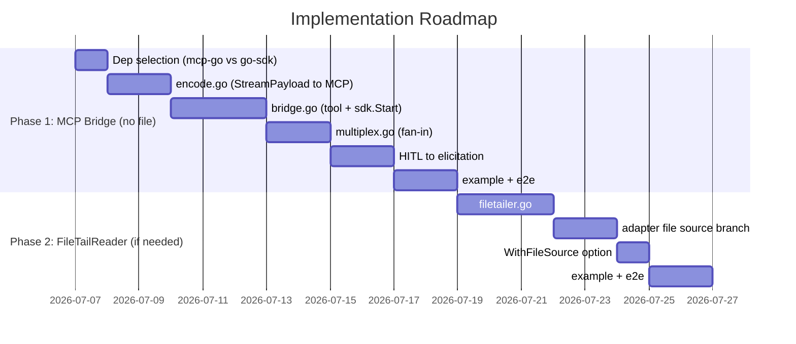

# Plan: MCP Server 双路输出融合（FileTailReader + multiplexSink + MCP Bridge）

> 状态：**Draft — 待评审**
> 作者：军师
> 日期：2026-07-06
> 关联 AGENTS 约束：§2.1 一套执行语义 / §7 adapter-helper 边界 / §2.4 依赖选型 / §8 非目标

---

## 0. TL;DR（先看结论）

| 维度 | 结论 |
|---|---|
| 设想大方向 | ✅ 可行，"输入源换文件、parser/dualSink 不动"的判断正确 |
| 最关键的遗漏 | 🔴 **"为什么必须用文件"没有说清**——pipe 模式大概率已经够用，文件引入额外复杂度 |
| multiplexSink 放哪 | ⚠️ 不该进 core SDK，应放 **bridge 层** fan-in 多个 RunHandle |
| MCP 流式映射 | ✅ Streamable HTTP + SSE notification 可承载 token 级流，跟现有 sse/agui bridge 同构 |
| 最大架构风险 | 🔴 child agent 进程生命周期管理断裂（clihelper 既 fork 又读，FileTailReader 只读不 fork） |
| 推荐落地姿势 | 分两阶段：**先做不需要文件的 MCP bridge**，再按需加 FileTailReader |

---

## 1. 背景与动机

### 1.1 用户想做什么

做一个 **MCP Server**，核心能力：

1. 通过 `agent-adaptor` SDK 调用一个 child coding agent（codex / claude / cursor）
2. child agent 的实时 stdout 被写入一个文件
3. SDK 实时 tail 这个文件，把内容解析成结构化事件返回上层
4. 同时 MCP Server 自身（"主 agent"）的输出也要一起返回上层 MCP Client

### 1.2 现有架构回顾（为什么用户觉得"换输入源"可行）

当前事件管线：

```
sdk.Start/Run → adapter.Run(ctx, req, sink)
  ├─ clihelper.Run: exec.CommandContext fork 子进程 + 读 stdout/stderr pipe
  │    └─ readPump: 每个 chunk → sink.Emit(RunEventChunk) + req.Observe(stream, chunk, ts)
  │         └─ Observe = parser.onChunk  ← 各 adapter 自己的行缓冲 + JSON 解析
  │              └─ parser 产出 TranscriptItem / Output / Summary / Result / Checkpoint
  └─ dualSink.Emit / EmitStream → fan-out 到 Events() / StreamEvents() channel
```

关键观察（用户的判断正确）：

- **parser 的入口是 `onChunk(stream string, chunk []byte, ts time.Time) error`**——它只认字节块，不关心数据来自 pipe 还是 file。codex / claude / cursor 三个 parser 都是同一个签名（见 `codex/parser.go:47`、`claude/parser.go`、`cursor/parser.go:53`）。
- **dualSink 是纯 EventSink 实现**，跟输入源完全解耦。
- 所以"把输入源从 pipe 换成 file tail，后面的解析和上报链路不动"——**技术上成立**。

### 1.3 现有 bridge 模式（MCP bridge 的直接参考）

SDK 已经有两个把事件流编码成协议帧的 bridge：

| Bridge | 路径 | 输入 | 输出 |
|---|---|---|---|
| `pkg/bridges/agui` | SDK `StreamEvents()` → AG-UI events | `RunHandle` | `chan aguievents.Event` |
| `pkg/bridges/sse` | HTTP POST → `sdk.Start` → SSE 帧 | HTTP Request | SSE 帧（AG-UI 或 Raw StreamPayload JSON） |

**MCP bridge 会是同级的第三个 bridge**，模式完全一致：MCP `tools/call` → `sdk.Start` → drain `StreamEvents()` → 编码成 MCP notification + 最终 tool result。

---

## 2. Review：设想的可行性评估

### 2.1 ✅ 正确的部分

1. **"输入源换文件，parser/dualSink 不动"**——成立。parser 的 `onChunk` 签名是数据源中立的。
2. **"FileTailReader 是新增输入源，pipe 模式不动"**——方向正确，并列而非替换。
3. **"multiplexSink 合并两路输出"**——概念正确，但位置错了（见 2.2-C）。
4. **"MCP 协议侧用 Streaming JSON-RPC 或 SSE 编码"**——跟 MCP Streamable HTTP spec 吻合。

### 2.2 ⚠️ / 🔴 遗漏与风险

#### 🔴 A. 最根本的追问：**为什么必须用文件？**

这是整个设想里最需要先回答的问题。当前 `clihelper` 已经 fork child agent + 读 pipe，**pipe 比文件更实时、更可靠、零额外复杂度**。文件只在以下场景才有不可替代的价值：

| 场景 | 文件是否必要 | 说明 |
|---|---|---|
| child agent 是 SDK 直接 fork 的本地 CLI | ❌ 不必要 | pipe 完全够用 |
| child agent 是容器化/远程的，stdout 无法 pipe | ✅ 必要 | 唯一交换通道是挂载卷文件 |
| 需要持久化/重放/多消费者 | ✅ 必要 | 文件是天然持久化 |
| child agent 已经在写 transcript 文件（如 codex session） | ✅ 可复用 | 省去重定向 |
| 主 agent 与 child agent 解耦进程生命周期 | ⚠️ 看情况 | pipe 也能解耦（两个 RunHandle） |

**强烈建议在动工前明确这个问题的答案**。如果答案是"child agent 就是 SDK fork 的本地 CLI"，那整个 FileTailReader 模块都不需要——直接用 pipe 模式 + bridge 层 fan-in。

> 本 Plan 后续仍会给出 FileTailReader 的完整设计，但默认假设是 **"child agent 不由 SDK fork，其 stdout 只能通过文件获取"**。如果该假设不成立，跳到 §9 备选方案 A。

#### 🔴 B. child agent 进程生命周期管理的断裂

`clihelper.Run` 当前耦合了两件事：
- **① fork 进程**（`exec.CommandContext` + `cmd.Start` + `cmd.Wait`）+ 管 stdin
- **② 读 pipe**（`readPump`）+ chunk 回调

`FileTailReader` 只做 ② 不做 ①。这意味着：

- **谁启动 child agent？** ——只能是宿主（MCP Server）自己 fork，或 child agent 是外部已运行进程
- **谁检测 child agent 退出？** ——pipe 模式下 `cmd.Wait()` 天然检测；文件模式下没有这个信号
- **谁杀死 child agent？** ——ctx cancel 时，pipe 模式杀进程；文件模式下 FileTailReader 没有进程句柄

**这是最大的架构缺口**。如果不在设计里明确回答，会导致 child agent 僵尸进程、文件无限等待等问题。

#### ⚠️ C. multiplexSink 不应该进 core SDK

用户设想"新增一个 multiplexSink 从两路收事件合并"。但 SDK 的核心合同是：

> **一次 `Run/Start` → 一个 `RunHandle` → 一个 `dualSink`**（AGENTS.md §2.1 北极星）

`dualSink` 内部有 per-run 的 HITL 决策派发、stream counter、backpressure 策略。如果 multiplexSink 在 core 里合并两个 dualSink 的输出，会：
- 破坏 per-run stream counter 的单调性（两个 run 的 Seq 会重叠）
- 模糊 HITL 决策的归属（哪个 run 的 DecisionRequest？）
- 引入"第二套执行入口"嫌疑（违反 §2.1）

**正确位置是 bridge 层**：bridge fan-in 多个 `RunHandle.StreamEvents()` channel，按时间戳归并。core SDK 保持"一个 run 一个 handle"的纯粹性。这跟 `agui.Wrap(handle)` 接受单个 handle 的模式一致——合并是 bridge 的事。

#### ⚠️ D. "主 agent 输出"的来源没有定义

用户说"主 agent（MCP Server 自身）的输出也需要同时返回"。但"主 agent"是什么？

| 可能的理解 | 含义 | 是否需要文件 |
|---|---|---|
| ① MCP Server 自己是个 coding agent（也在跑 codex/claude） | 两个 SDK Run，合并两个 RunHandle | ❌ 不需要文件 |
| ② MCP Server 是编排逻辑，产出自己的文本日志 | 宿主手动 emit 文本到合并流 | ❌ 不需要文件 |
| ③ MCP Server 是一个已经在写的进程，stdout 被重定向 | 跟 child agent 一样走文件 | ✅ 需要文件 |

**需要澄清**。如果是 ①，那根本不需要文件——两个 `sdk.Start` 两个 handle，bridge fan-in。如果是 ③，那主 agent 和 child agent 都走 FileTailReader。

#### ⚠️ E. AGENTS.md 硬约束的对照

| 约束 | 冲突？ | 分析 |
|---|---|---|
| §2.1 只有一套执行语义 | ⚠️ 边界 | 执行语义是 `Run/Start → adapter.Run → sink`，不变。但 adapter 内部输入源分叉（pipe vs file），需确保 adapter 接口合同不变 |
| §7.1 clihelper 负责启进程 | 🔴 冲突 | FileTailReader 不启进程，**不能放进 clihelper**。必须是独立模块 |
| §7.3 checkpoint 必须由 adapter 解析 | ✅ 不冲突 | parser 不变，checkpoint 逻辑不变 |
| §8 非目标：不内置 server | ✅ 不冲突 | MCP bridge 放 `pkg/bridges/mcp/`，是 bridge 不是 core server |
| §2.4 依赖局部化 | ✅ 兼容 | MCP SDK 仅 bridge 包 import |

#### ⚠️ F. 文件 I/O 实时性与边界

用户已经提到行缓冲问题。补充完整清单：

- **缓冲模式**：child agent 若用全缓冲（非 tty 时默认），文件可能几十秒才 flush。需 `stdbuf -oL` / `unbuffer` / child agent 自己的 `--line-buffered` 选项
- **轮询 vs inotify**：轮询（`time.Ticker` + `Read`）有延迟但跨文件系统通用；`fsnotify` 实时但 NFS/overlayfs 不可靠
- **文件轮转**：logrotate rename + recreate，tail 需重新 open
- **文件截断**：`> file` 会截断，tail 需重置 offset
- **EOF 不退出**：tail 不能在 EOF 时结束，要继续等（跟 pipe 的 EOF 语义不同）
- **文件被删除**：child agent 还在写但文件被 rm，tail 报错

---

## 3. 整体架构设计

### 3.1 目标架构（三层）

```
┌─────────────────────────────────────────────────────────────────────┐
│                        MCP Client（上层）                           │
│              Claude Desktop / Cursor / 任意 MCP Client              │
└───────────────┬─────────────────────────────────────────────────────┘
                │ MCP 协议（JSON-RPC 2.0 over Streamable HTTP / stdio）
                │   tools/call 请求 → 期间 notification → 最终 result
┌───────────────▼─────────────────────────────────────────────────────┐
│                  pkg/bridges/mcp/（新增 MCP Bridge）                │
│                                                                     │
│  ┌─────────────┐    ┌──────────────────────────────────────────┐    │
│  │ MCP Server  │───▶│        multiplexSink（bridge 层）         │    │
│  │ Tool 注册   │    │  fan-in 多个 RunHandle.StreamEvents()     │    │
│  │ + 编解码    │    │  按时间戳归并 → 统一 MCP notification 流   │    │
│  └─────────────┘    └──────┬──────────────────────┬────────────┘    │
│                            │ run A                │ run B           │
│                            │ (child agent)        │ (主 agent)      │
└────────────────────────────┼──────────────────────┼─────────────────┘
                             │                      │
┌────────────────────────────▼──────────────────────▼─────────────────┐
│                    agent-adaptor SDK core（不动）                   │
│                                                                     │
│   sdk.Start(ctx, prompt, opts) → RunHandle                          │
│   ┌──────────────────────────────────────────────────────────┐      │
│   │ adapter.Run(ctx, req, dualSink)                          │      │
│   │   ├─ [pipe 模式] clihelper.Run: fork + read pipe         │      │
│   │   └─ [file 模式] FileTailReader: tail 文件 + 回调       │      │
│   │        └─ parser.onChunk(stream, chunk, ts) ← 同一签名   │      │
│   │             └─ Transcript / Output / Checkpoint         │      │
│   └──────────────────────────────────────────────────────────┘      │
└────────────────────────────────────────────────────────────────────-┘
```

### 3.2 数据流（两种模式）

**模式 A：pipe 模式（默认，child agent 由 SDK fork）**

```
MCP tools/call
  → sdk.Start(prompt)  ── SDK fork codex CLI ── read pipe
  → RunHandle.StreamEvents() ─────────────────────┐
  → RunHandle.Wait() → RunResult                   │ (bridge fan-in)
                                                   │
MCP Server 自身输出 ─→ 手动构造 StreamPayload ─────┘
  → 统一编码成 MCP notification
  → 最终 tool result
```

**模式 B：file 模式（child agent 由宿主 fork，stdout 落文件）**

```
宿主 fork child agent + 重定向 stdout → /tmp/run-xxx.log
  → sdk.Start(prompt, WithFileSource(path))  ── SDK tail 文件
  → parser.onChunk ←── FileTailReader 喂 chunk
  → RunHandle.StreamEvents() ─────────────────────┐
  → RunHandle.Wait() → RunResult                 │ (bridge fan-in)
                                                   │
主 agent 输出 ─────→ 同样可走 file 或 pipe ────────┘
  → 统一编码成 MCP notification
  → 最终 tool result
```

### 3.3 关键设计决策

| 决策 | 选择 | 理由 |
|---|---|---|
| FileTailReader 位置 | `internal/filetailer/`（独立模块） | 不进 clihelper（不启进程，违反 §7.1）；parser 复用通过回调 |
| multiplexSink 位置 | `pkg/bridges/mcp/`（bridge 层） | 不进 core（保持一 run 一 handle）；fan-in 是 bridge 职责 |
| MCP bridge 位置 | `pkg/bridges/mcp/` | 跟 sse/agui 同级，符合 §2.4 局部化 |
| child agent 进程生命周期 | 宿主负责（file 模式）/ SDK 负责（pipe 模式） | FileTailReader 不持有进程句柄，宿主必须管 |
| MCP Go SDK | `mark3labs/mcp-go`（首选）或官方 `go-sdk` | 见 §6.3 依赖选型 |
| parser 复用方式 | adapter 内部 input source 分支选择 | 不改 parser，不改 adapter 接口 |

---

## 4. 模块划分与职责

### 4.1 模块全景

```
internal/filetailer/          ← 新增：文件 tail 读取器
  ├─ filetailer.go            ← FileTailReader + 轮询/inotify 策略
  └─ filetailer_test.go

pkg/bridges/mcp/              ← 新增：MCP 协议 bridge
  ├─ bridge.go                ← MCP Server + tool 注册 + 事件编码
  ├─ multiplex.go             ← multiplexSink（fan-in 多 RunHandle）
  ├─ encode.go                ← StreamPayload → MCP notification 映射
  └─ bridge_test.go

codex/driver.go (改)          ← adapter 内部加 file source 分支
claude/driver.go (改)         ← 同上
cursor/driver.go (改)         ← 同上
  （三个 adapter 加一个 input source 选择，parser 不动）

options.go (改)               ← 新增 WithFileSource(path) RunOption
run_types.go (改)             ← DriverRunRequest 加 FileSource 字段
```

### 4.2 各模块职责

#### `internal/filetailer/` — 文件 tail 读取器

| 职责 | 说明 |
|---|---|
| 打开文件 + 跟随 EOF 继续读 | 跟 `tail -f` 语义一致 |
| 按行/按 chunk 输出 | 通过 `ChunkObserver` 回调喂给 parser（签名跟 clihelper 一致） |
| 处理轮转/截断/删除 | 重新 open 或报错 |
| 退出信号 | ctx cancel 或显式 `Close()` |

**不负责**：fork 进程、解析协议、判断 checkpoint、管 stdin。

#### `pkg/bridges/mcp/` — MCP Bridge

| 职责 | 说明 |
|---|---|
| 注册 MCP tool（如 `run_agent`） | 接收 `tools/call`，触发 `sdk.Start` |
| 编码 SDK 事件 → MCP notification | StreamPayload → progress / logging / 自定义 notification |
| fan-in 多个 RunHandle | multiplexSink 按时间戳归并 |
| 最终 tool result | `RunResult` → MCP `CallToolResult`（content 数组） |
| HITL → MCP elicitation | `DecisionRequest` → MCP `elicitation/create`（server→client 请求） |

#### adapter 改动（codex/claude/cursor）

每个 adapter 的 `Run` 方法加一个分支：

```go
// 伪代码
if req.FileSource != "" {
    // file 模式：用 FileTailReader 读文件，喂给同一个 parser
    err = filetailer.Run(ctx, req.FileSource, parser.onChunk, sink)
} else {
    // pipe 模式：原有 clihelper.Run
    result, err = clihelper.Run(ctx, clihelper.CommandRequest{..., Observe: parser.onChunk}, sink)
}
```

parser 完全不动，`finalize()` / `checkpoint()` 等后续逻辑也不变。

---

## 5. 关键接口设计

### 5.1 FileTailReader

```go
package filetailer

// ChunkObserver 跟 clihelper.ChunkObserver 签名一致，parser 无需改动。
type ChunkObserver func(stream string, chunk []byte, ts time.Time) error

// Config 控制 tail 行为。
type Config struct {
    // Path 是被 tail 的文件路径。
    Path string
    // Stream 标记 chunk 来源（"stdout" / "stderr"），传给 observer。
    // 当主输出和错误输出分开为两个文件时，各自用一个 FileTailReader。
    Stream string
    // PollInterval 是轮询间隔。0 = 默认 50ms。
    // 优先用 fsnotify 事件；不可用时回退轮询。
    PollInterval time.Duration
    // StartOffset 是初始读取位置。0 = 从文件末尾开始（只看新内容）。
    // -1 = 从文件开头。>0 = 绝对 offset。
    StartOffset int64
    // Follow controls whether to keep reading after EOF (tail -f).
    // false = 读到 EOF 就返回（适合一次性读取）。
    Follow bool
    // OnRotate 在检测到文件轮转时调用（可选）。
    OnRotate func(oldPath, newPath string)
}

// Run tails 文件并把 chunk 通过 observer 喂出。
// 阻塞直到 ctx cancel 或文件关闭且 Follow=false。
// Run 不负责启动任何进程——child agent 的生命周期由调用方管理。
func Run(ctx context.Context, cfg Config, observe ChunkObserver) error
```

**关键语义**：

- `Follow=true`（默认）：到达 EOF 不返回，继续轮询，直到 ctx cancel。对应 `tail -f`。
- 文件不存在时：等待创建（轮询），不立即报错。
- 文件轮转（inode 变化）：重新 open，从头或从 StartOffset 开始。
- `observer` 返回 error 时中止（跟 clihelper 一致）。

### 5.2 multiplexSink（bridge 层 fan-in）

```go
package mcpbridge

// MultiplexSource 是一个可被 fan-in 的事件源。
// 通常是一个 RunHandle，但也允许宿主注入自定义文本流。
type MultiplexSource interface {
    StreamEvents() <-chan agentadaptor.StreamPayload
    Wait(ctx context.Context) (agentadaptor.RunResult, error)
}

// MultiplexOptions 控制 fan-in 归并行为。
type MultiplexOptions struct {
    // Sources 是要合并的事件源列表。
    Sources []MultiplexSource
    // Tag 给每个 source 的输出打标签（注入到 StreamPayload.Raw["source"]）。
    Tags []string
    // OnError 控制某个 source 出错时的策略。
    //   "abort" = 任一 source 出错就整体中止（默认）
    //   "continue" = 其他 source 继续，出错的不再产生事件
    OnError string
}

// Multiplex 返回一个合并后的 StreamPayload channel。
// 按 Timestamp 归并，保证时间顺序。所有 source 结束后关闭 channel。
func Multiplex(ctx context.Context, opts MultiplexOptions) <-chan agentadaptor.StreamPayload
```

**为什么不进 core**：

- core 的 `dualSink` 是 per-run 的，stream counter / HITL 派发都是 per-run 语义
- 合并多个 run 会破坏这些不变量
- bridge 层 fan-in 只做"归并 channel"这一件事，干净且可选

### 5.3 MCP Bridge

```go
package mcpbridge

// Options 配置 MCP bridge。
type Options struct {
    // SDK 是要桥接的 agent-adaptor SDK 实例。
    SDK agentadaptor.SDK
    // ToolName 是暴露给 MCP client 的工具名（默认 "run_agent"）。
    ToolName string
    // ToolDescription 是工具描述。
    ToolDescription string
    // Transport 选择 MCP 传输层。
    Transport MCPTransport  // "stdio" | "streamable-http"
    // Addr 是 HTTP 监听地址（仅 streamable-http）。
    Addr string
    // PrimarySource 控制是否把 SDK 默认 agent 作为主输出源。
    //   true = SDK Run 的输出就是主输出（单源，不需要 multiplex）
    //   false = 调用方自己组装 MultipleSource（多源合并）
    PrimarySource bool
    // RunOptions 是附加到每次 sdk.Start 的选项。
    RunOptions []agentadaptor.RunOption
    // NotificationMode 控制 SDK 事件 → MCP notification 的编码策略。
    NotificationMode NotificationMode
}

// NotificationMode 枚举事件编码策略。
type NotificationMode int
const (
    // NotifyProgress 把 token delta 编码进 notifications/progress 的 message 字段。
    // 粗粒度，但所有 MCP client 都支持。
    NotifyProgress NotificationMode = iota
    // NotifyCustom 用自定义 notification（如 "notifications/agent_stream"），
    // 携带完整 StreamPayload JSON。需要 client 配合解析。
    NotifyCustom
    // NotifyLogging 用 notifications/message（logging level），
    // data 字段携带 StreamPayload JSON。
    NotifyLogging
)

// ServeStdio 在 stdin/stdout 上启动 MCP server（JSON-RPC over stdio）。
func ServeStdio(ctx context.Context, opts Options) error

// ServeHTTP 在 HTTP 上启动 MCP server（Streamable HTTP transport）。
func ServeHTTP(ctx context.Context, opts Options) error
```

**事件映射规则**（`encode.go`）：

| SDK StreamPayload | MCP notification / response | 说明 |
|---|---|---|
| `StreamRunStarted` | （不映射，内部状态） | 用于启动流 |
| `StreamTextContent` | `notifications/progress`（message=delta）或自定义 | token 级流 |
| `StreamToolCallStart` | `notifications/progress`（message="[tool: name]"） | 工具开始 |
| `StreamToolCallArgs` | 自定义 notification（raw JSON） | 工具参数流 |
| `StreamReasoningContent` | `notifications/message`（level=debug） | 思考流 |
| `StreamHITLRequested` | `elicitation/create`（server→client 请求） | HITL |
| `StreamRunFinished` | 终止 notification + 最终 `tools/call` response | 完成 |
| `StreamRunError` | `notifications/message`（level=error）+ error response | 失败 |

**最终 tool result**（`RunResult` → MCP `CallToolResult`）：

```
RunResult.Output       → content[0] = {type:"text", text: Output}
RunResult.Summary      → content[1] = {type:"text", text: "[summary] " + Summary}（可选）
RunResult.Session.ID   → _meta.sessionId
RunResult.Usage        → _meta.usage
RunResult.Failure      → isError=true + content 里带错误信息
```

### 5.4 adapter / RunOption 扩展

```go
// options.go 新增

// WithFileSource 切换 adapter 到文件输入模式。
// path 是 child agent stdout 落盘的文件路径。
// child agent 的进程生命周期由调用方负责（SDK 不 fork）。
func WithFileSource(path string) RunOption
```

```go
// run_types.go 的 DriverRunRequest 新增字段

type DriverRunRequest struct {
    // ... 现有字段 ...
    FileSource string  // 非空时 adapter 用 FileTailReader 代替 clihelper
}
```

```go
// run_types.go 的 RawStreams 补充说明
// file 模式下 RawStreams.Stdout = 文件全部内容，Stderr 为空（或第二个文件）
```

---

## 6. 各模块实现步骤

### 6.1 Phase 1：MCP Bridge（不需要文件，先跑通）

> **这是推荐的第一步**——先证明 SDK 事件流能编码成 MCP，再决定是否需要文件。

| 步骤 | 内容 | 产出 |
|---|---|---|
| 1.1 | 依赖选型：评估 `mark3labs/mcp-go` vs `modelcontextprotocol/go-sdk` | §6.3 决策记录 |
| 1.2 | 实现 `pkg/bridges/mcp/encode.go`：StreamPayload → MCP notification 映射 | 编码层单测 |
| 1.3 | 实现 `pkg/bridges/mcp/bridge.go`：MCP tool 注册 + `sdk.Start` 调用 + drain StreamEvents | bridge 单测 |
| 1.4 | 实现 `pkg/bridges/mcp/multiplex.go`：fan-in 多 RunHandle（即使单源也先建好框架） | multiplex 单测 |
| 1.5 | HITL → elicitation 映射 | HITL 集成测试 |
| 1.6 | example：`examples/mcp-server/main.go`（stdio + streamable-http 两个 demo） | 可运行示例 |

**Phase 1 验收标准**：
- MCP Client（如 Claude Desktop）能发现 `run_agent` tool
- 调用后能收到 token 级流式 notification
- 最终拿到结构化 result
- 单源场景完全可用

### 6.2 Phase 2：FileTailReader（仅当确实需要文件时）

| 步骤 | 内容 | 产出 |
|---|---|---|
| 2.1 | 实现 `internal/filetailer/filetailer.go`：轮询 tail + EOF 跟随 + 轮转处理 | filetailer 单测 |
| 2.2 | 可选：接入 `fsnotify` 加速（不可用时回退轮询） | 性能测试 |
| 2.3 | codex/claude/cursor adapter 加 `FileSource` 分支 | adapter 单测 |
| 2.4 | `options.go` + `run_types.go` 加 `WithFileSource` + `DriverRunRequest.FileSource` | 集成测试 |
| 2.5 | example：`examples/mcp-server-filesource/main.go`（宿主 fork child + 重定向 + SDK tail） | 端到端示例 |

**Phase 2 验收标准**：
- 宿主 fork child agent + 重定向 stdout 到文件
- SDK tail 文件，parser 正确解析，事件流跟 pipe 模式一致
- child agent 退出后 SDK 能正确结束（需要宿主 cancel ctx 或文件 EOF marker）

### 6.3 依赖选型：Go MCP SDK

按 AGENTS.md §2.4 三条评估：

| 维度 | `mark3labs/mcp-go` | `modelcontextprotocol/go-sdk`（官方） |
|---|---|---|
| 可靠性 | spec 2025-11-25 合规，8200+ stars，v0.44.0（2026-02） | 官方维护，spec 合规 |
| 可持续维护 | 社区主流，活跃迭代 | **官方 + Google 协作，最可持续** |
| 可局部化 | 仅 `pkg/bridges/mcp/` import，不污染 core | 同左 |
| Transport 覆盖 | **stdio + streamable HTTP + SSE 全覆盖** | stdio + command（HTTP 待补全） |
| API 风格 | builder pattern，快速上手 | typed server scaffolding |

**推荐**：**Phase 1 用 `mark3labs/mcp-go`**（transport 覆盖全，快速跑通）。若官方 `go-sdk` 在 streamable HTTP 上补齐且稳定性验证后，可切换（两者 API 迁移成本可控）。

> 跟现有 `sourcegraph/jsonrpc2`（codex appserver 用）的关系：codex appserver 是 SDK **调用** codex 的 JSON-RPC client；MCP bridge 是 SDK **暴露**给上层的 server。两者方向相反，不冲突。若 MCP bridge 走 stdio transport，技术上也可复用 `sourcegraph/jsonrpc2` 手写，但 MCP 协议握手/能力协商复杂，优先用成熟 SDK。

---

## 7. 与现有 SDK 架构的兼容性分析

### 7.1 逐条对照 AGENTS.md 硬约束

| 约束 | 兼容？ | 说明 / 缓解 |
|---|---|---|
| §2.1 一套执行语义 | ✅ | `Run/Start → adapter.Run → dualSink` 不变。file 模式只是 adapter 内部输入源切换，不是第二入口 |
| §2.2 默认 Agent 绑定 | ✅ | MCP bridge 调 `sdk.Start`，走默认 agent，不变 |
| §2.3 无状态默认 | ✅ | session 语义不变 |
| §2.4 依赖局部化 | ✅ | MCP SDK 仅 `pkg/bridges/mcp/` import；fsnotify 仅 `internal/filetailer/` |
| §3.1 SDK 接口 | ✅ | 不改 `SDK/Runner/RunHandle` 接口 |
| §3.4 输出合同 | ✅ | `RunResult.Output/RawStreams/Transcript/Summary/Result` 不变。file 模式下 `RawStreams.Stdout` = 文件内容 |
| §7.1 clihelper 职责 | ✅ | FileTailReader **不进 clihelper**，是独立模块。clihelper 仍只做 fork+pipe |
| §7.2 helper 不解析协议 | ✅ | FileTailReader 只读 chunk 不解析，跟 clihelper 一致 |
| §7.3 checkpoint 由 adapter 解析 | ✅ | parser 不变，checkpoint 逻辑不变 |
| §8 非目标（不内置 server） | ✅ | MCP bridge 是 bridge 不是 core server；宿主按需嵌入 |
| §9 禁止复活 Registry/第二入口 | ✅ | adapter 接口 `DriverAdapter.Run` 不变 |

### 7.2 潜在争议点

**争议 1：adapter 内部 input source 分叉是否算"第二套执行入口"？**

> 不算。执行入口是 `sdk.Run/Start`，输入源是 adapter 实现细节。clihelper 已经是 adapter 内部 helper，换成 FileTailReader 只是换 helper。adapter 对外的 `DriverRunResult` 合同完全不变。

**争议 2：file 模式下 RawStreams 的语义**

> pipe 模式下 `RawStreams.Stdout` 是子进程 stdout 全量。file 模式下，`RawStreams.Stdout` 应该是 **tail 到的文件全量内容**。这在语义上一致（都是"原始输出全量"）。但要注意：如果文件在被 tail 前就有历史内容（StartOffset=0 从末尾开始），RawStreams 只包含 tail 到的部分。需在文档里说明 file 模式下 RawStreams 的范围定义。

**争议 3：file 模式下 child agent 退出检测**

> 这是 file 模式的核心难点。pipe 模式下 `cmd.Wait()` 天然检测退出。file 模式下，建议：
> - **方案 1（推荐）**：宿主负责 child agent 生命周期，child agent 退出后宿主 cancel SDK 的 ctx
> - **方案 2**：child agent 在退出前写一个 sentinel 行（如 `{"type":"__eof__"}`），parser 识别后结束
> - **方案 3**：FileTailReader 监控 child agent PID（需宿主传入 PID），PID 消失 + 文件 EOF 后结束

---

## 8. 风险与缓解措施

| # | 风险 | 等级 | 缓解 |
|---|---|---|---|
| R1 | **文件不需要**——child agent 就是 SDK fork 的，pipe 够用 | 🔴 高 | Phase 1 先做不带文件的 MCP bridge；确认 pipe 不够再上 Phase 2 |
| R2 | child agent 进程僵尸（file 模式下无人回收） | 🔴 高 | 明确宿主职责；文档强约束；提供 PID 监控选项 |
| R3 | 文件缓冲导致延迟（全缓冲时几十秒才 flush） | 🟡 中 | 文档要求 `stdbuf -oL`；adapter 检测延迟并 warn |
| R4 | fsnotify 在 NFS/overlayfs 不可靠 | 🟡 中 | 回退轮询；轮询间隔可配 |
| R5 | MCP notification 流式不被某些 client 支持 | 🟡 中 | 提供 `NotifyProgress`（最通用）作为默认；`NotifyCustom` 作为可选 |
| R6 | multiplexSink 时间戳归并乱序 | 🟡 中 | 各 source 独立 channel；归并用 Timestamp；容忍小窗口乱序 |
| R7 | MCP Go SDK 版本快速迭代导致 breaking change | 🟡 中 | bridge 层封装 MCP SDK 调用，隔离 breaking change |
| R8 | HITL elicitation 超时 vs SDK RunPolicy 超时不一致 | 🟡 中 | bridge 层对齐超时；elicitation 超时映射到 RunPolicy.OnTimeout |
| R9 | file 模式下 session/checkpoint 语义模糊 | 🟡 中 | checkpoint 仍由 parser 解析；file 模式下 session 恢复需宿主配合提供文件路径 |

---

## 9. 备选方案

### 备选 A：完全不用文件（纯 pipe + bridge fan-in）

**适用场景**：主 agent 和 child agent 都是 SDK fork 的本地 CLI。

```
MCP tools/call
  → sdk.Start(prompt)          ── child agent (Run A)
  → sdk.Start(orchestration)   ── 主 agent (Run B)，或不需要
  → bridge.Multiplex([handleA, handleB])
  → MCP notification + result
```

**优点**：零文件 I/O 复杂度；进程生命周期 SDK 全管；最可靠。
**缺点**：child agent 必须是 SDK 能直接 fork 的本地 CLI。

**推荐**：如果场景符合，这是最优解。Phase 1 就是这个方案。

### 备选 B：用 pipe 但宿主自己 fork child agent

**适用场景**：child agent 不是 SDK fork 的，但跟宿主在同机，可以拿 stdout pipe。

宿主自己 `exec.Command` fork child agent，拿到 `cmd.StdoutPipe()`，把 `io.Reader` 传给 SDK。SDK 的 adapter 用一个 `PipeReaderSource`（跟 FileTailReader 同构，只是读 `io.Reader` 而非文件）。

**优点**：比文件实时；无缓冲问题；进程生命周期宿主管但 pipe 能感知 EOF。
**缺点**：需要宿主暴露 `io.Reader` 给 SDK（新增 `WithStdoutReader(r io.Reader)` RunOption）。

**推荐**：如果 child agent 跟宿主在同机且能拿 pipe，**优先于文件**。

### 备选 C：用 codex appserver 模式（JSON-RPC 直连）

如果 child agent 是 codex 且支持 `codex app-server`，SDK 已经有 `codex/appserver/` 模块直接走 JSON-RPC，不经过 clihelper。这是最原生的流式方案。但仅限 codex，且需要 app-server 支持。

---

## 10. 里程碑 / 阶段划分



| 阶段 | 目标 | 验收 | 预估 |
|---|---|---|---|
| Phase 1 | MCP bridge（pipe 模式）可用 | MCP Client 能调用 `run_agent`，收到流式 notification + 最终 result | ~12 人日 |
| Phase 2 | FileTailReader（仅按需） | 宿主 fork child + 重定向文件，SDK tail 解析正确 | ~8 人日 |
| Phase 3（可选） | fsnotify 加速 + 多文件（stdout/stderr 分开） | 性能达标；边界场景覆盖 | ~4 人日 |

---

## 11. 待决策清单（需用户确认）

| # | 问题 | 选项 | 推荐 |
|---|---|---|---|
| Q1 | child agent 是 SDK fork 的本地 CLI 吗？ | 是 / 否 | **决定是否需要 Phase 2** |
| Q2 | "主 agent 输出"来自哪里？ | ① 另一个 SDK Run / ② 宿主文本 / ③ 另一个文件源 | 影响 multiplex 设计 |
| Q3 | child agent stdout 能直接拿 pipe 吗？ | 能 / 不能（只能文件） | 能→用备选 B |
| Q4 | MCP transport 选 stdio 还是 streamable-http？ | stdio（Claude Desktop）/ http（Web） | 两个都做 |
| Q5 | notification 编码策略？ | progress / custom / logging | 默认 progress，可选 custom |
| Q6 | Go MCP SDK 选哪个？ | mark3labs/mcp-go / 官方 go-sdk | Phase 1 用 mark3labs |

---

## 附录 A：现有代码关键位置速查

| 文件 | 行 | 内容 |
|---|---|---|
| `api.go:216` | `EventSink` 接口（`Emit` / `EmitStream`） | adapter 写事件的入口 |
| `runner.go:679` | `dualSink` 结构 | per-run sink 实现 |
| `runner.go:756` | `dualSink.Emit` | RunEvent channel 写入 |
| `runner.go:772` | `dualSink.EmitStream` | StreamPayload channel 写入 |
| `internal/clihelper/clihelper.go:369` | `readPump` | pipe 读 chunk + Observe 回调 |
| `internal/clihelper/clihelper.go:31` | `ChunkObserver` 签名 | parser 入口签名（file 模式复用） |
| `codex/parser.go:47` | `codexParser.onChunk` | codex 行解析 |
| `claude/parser.go` | `claudeParser.onChunk` | claude 行解析 |
| `cursor/parser.go:53` | `cursorParser.onChunk` | cursor 行解析 |
| `codex/driver.go:442` | `clihelper.Run` 调用处 | adapter 入口（file 模式分支点） |
| `pkg/bridges/agui/bridge.go:424` | `agui.Wrap` | SDK→AG-UI 事件桥（MCP bridge 参考） |
| `pkg/bridges/sse/handler.go:108` | `sse.Handler` | SDK→SSE HTTP 桥（MCP bridge 参考） |
| `mcp_types.go:27` | `MCPServerSpec` | SDK 给 child agent 注入 MCP server 的配置（**不是**把 SDK 包成 server） |
| `codex/appserver/client.go` | JSON-RPC client | SDK 调 codex app-server 的 JSON-RPC 实现（方向相反，可参考） |

## 附录 B：MCP 协议流式能力速查

| 能力 | 支持？ | 说明 |
|---|---|---|
| tool call 流式返回 result | ❌ | result 是最终一次性 JSON-RPC response |
| 流式期间推送 notification | ✅ | `notifications/progress` / `notifications/message` / 自定义 |
| Streamable HTTP transport | ✅ | POST 可返回 SSE 流，流里带 notification + 最终 response |
| server → client 请求（elicitation） | ✅ | `elicitation/create`，用于 HITL |
| stdio transport | ✅ | JSON-RPC over stdin/stdout，notification 夹在 response 之间 |
| 自定义 notification | ✅ | method 名不在保留集合内即可 |

**结论**：MCP 的流式靠 **notification 模拟**，不是 result 本身流式。这跟 SDK 的 `StreamEvents()` 模式天然适配——notification = StreamPayload，最终 response = RunResult。
