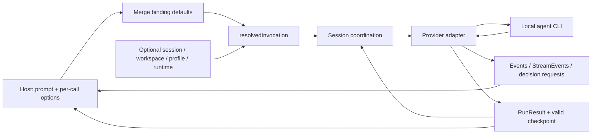

# agent-adaptor

[简体中文](./README.zh-CN.md)

[](https://github.com/agent-dance/agent-adaptor/actions/workflows/go.yml)
[](https://pkg.go.dev/github.com/agent-dance/agent-adaptor)
[](https://github.com/agent-dance/agent-adaptor/releases)
[](./go.mod)

Embed Codex, Claude Code, or Cursor Agent behind one stable Go host contract,
while keeping sessions, workspaces, profiles, streaming, human decisions, and
provider differences explicit, controllable, and auditable.

`agent-adaptor` is a pure SDK for teams building CLIs, desktop applications,
HTTP/gRPC services, background workers, or scheduled automation on top of local
coding agent CLIs. It owns the repeatable integration lifecycle; your host still
owns product routing, authentication, tenant policy, serving, and persistence.

Prerequisites: Go 1.26+ and an installed, authenticated Codex CLI for the Quick
Start below. Claude Code- or Cursor-only environments can begin with the
provider-selection recipe instead.

```bash
go get github.com/agent-dance/agent-adaptor
go run ./examples/recipes/basic-run
go run ./examples/recipes/provider-selection -agent=claude
go run ./examples/recipes/provider-selection -agent=cursor
```

## Why Not Call Each CLI Directly?

Starting a process is easy. Keeping three evolving protocols reliable inside a
product is the expensive part.

| Integration concern | Direct per-provider code | `agent-adaptor` contract |
|---|---|---|
| Invocation | Separate flags, environment, and defaults | One `Run` / `Start` path with binding defaults and per-call overrides |
| Sessions | Provider IDs and resume rules leak into the host | Optional `SessionStore`, compatibility checks, and valid-checkpoint persistence |
| Output | Ad hoc stdout parsing | Adapter-owned protocol parsing into result, events, content stream, and HITL |
| Managed context | Provider-specific workspace/profile mutation | Explicit workspace, profile, skills, MCP, instructions, and runtime-service inputs |
| Capability gaps | Usually discovered at runtime | Descriptors and preflight expose supported and unsupported modes |

The SDK does not choose an agent for you. The host makes that product decision
and binds a default agent plus any explicitly named agents.

## Quick Start

This program is exactly [`examples/recipes/basic-run/main.go`](./examples/recipes/basic-run/main.go).
It uses only public packages, relies on the CLI's configured default model, and
checks transport errors before structured run failures. The temporary workspace
and cloned profile are removed when the program exits.

```go
package main

import (
	"context"
	"fmt"
	"log"
	"os"
	"path/filepath"
	"time"

	agentadaptor "github.com/agent-dance/agent-adaptor"
	"github.com/agent-dance/agent-adaptor/codex"
)

func main() {
	if err := run(); err != nil {
		log.Fatal(err)
	}
}

func run() error {
	ctx, cancel := context.WithTimeout(context.Background(), 3*time.Minute)
	defer cancel()

	root, err := os.MkdirTemp("", "agent-adaptor-basic-*")
	if err != nil {
		return fmt.Errorf("create isolated environment: %w", err)
	}
	defer os.RemoveAll(root)
	workspace := filepath.Join(root, "workspace")
	if err := os.MkdirAll(workspace, 0o755); err != nil {
		return fmt.Errorf("create temporary workspace: %w", err)
	}

	sdk := agentadaptor.New(
		agentadaptor.WithDefaultAgent(codex.New(agentadaptor.CodexConfig{
			CommonConfig: agentadaptor.CommonConfig{
				CWD: workspace,
			},
			SkipGitRepoCheck: true,
		}, agentadaptor.WithCloneProfile(
			filepath.Join(root, "profile"),
			agentadaptor.CloneProfileOptions{IncludeSettings: true, AuthMode: agentadaptor.CloneProfileAuthLink},
		))),
	)

	result, err := sdk.Run(ctx, "Reply in one sentence confirming the SDK call succeeded.")
	if err != nil {
		return fmt.Errorf("run agent: %w", err)
	}
	if result.Failure != nil {
		return fmt.Errorf("agent run failed: %s", result.Failure.Message)
	}

	fmt.Println(result.Output)
	return nil
}
```

Use `claude.New(...)` or `cursor.New(...)` for another default binding. Use
`Build(...)` instead of `New(...)` when a service must return configuration
errors rather than fail fast during startup.

## Choose An Integration Path

| Product shape | Start with | Add next |
|---|---|---|
| Batch automation or CI worker | [`basic-run`](./examples/recipes/basic-run) | [`structured-output`](./examples/recipes/structured-output) for validated machine-readable results |
| Interactive application | [`content-streaming`](./examples/recipes/content-streaming) | [`hitl-channel`](./examples/recipes/hitl-channel) and durable session storage |
| Managed workstation | [`managed-profile`](./examples/showcases/managed-profile) | Admin preflight and organization-owned profile resources |
| Direct React integration | [`web-agui`](./examples/showcases/web-agui) | Authentication, durable replay, limits, and audit logs in the host |
| Full chat and HITL UI | [`web-copilotkit-hitl`](./examples/showcases/web-copilotkit-hitl) | Host-owned decision authorization and persistence |
| Agent-to-agent service | [`a2a-local`](./examples/showcases/a2a-local) | Authenticated discovery and durable A2A task storage |
| Mixed-provider agent team | [`team-agent-workflow`](./examples/showcases/team-agent-workflow) | Durable orchestration state, repair loops, and tenant-scoped role registries |

## One Execution Lifecycle

Every default or named runner resolves through the same internal path. Streaming
and HITL are optional channels on that run, not additional execution APIs.



The shared process helper transports stdin/stdout/stderr only. Each adapter
parses its official provider protocol and produces `Transcript`, `Output`,
terminal `Result`, and checkpoint validity from that same parse.

## Core Mental Model

- `SDK`: `sdk.Run(...)` and `sdk.Start(...)` always target the binding supplied
  by `WithDefaultAgent(...)`; `sdk.Admin()` is control-plane only.
- `Runner`: the single execution contract returned by `sdk.Default()` and
  `sdk.Agent(name)`. Named agents do not create a second execution path.
- `RunHandle`: exposes operational `Events()`, optional content
  `StreamEvents()`, `RunID()`, `Wait(...)`, `Cancel(...)`, and asynchronous HITL
  through `DecisionRequests()` / `ResolveDecision(...)`.

## Capabilities And Provider Differences

The portable contract is broad, but it does not imply identical provider
behavior. These rows reflect the current built-in descriptors and tests.

| Capability | Codex | Claude | Cursor | Current constraint |
|---|---:|---:|---:|---|
| Execution lifecycle | yes | yes | yes | `Run`, `Start`, wait, cancel, timeout, result, and operational events |
| Session resume | yes | yes | yes | Resume is guarded by workspace/profile/invocation compatibility |
| Content streaming | native | native | no | Codex and Claude emit token/reasoning/tool deltas; Cursor returns transcript/result |
| HITL Ask | no | PlanReview + Question | no | Permission `Ask` is unsupported by all three built-ins |
| Structured output | native + validate | native + validate | prompt + validate | Codex/Claude do not advertise native schema combined with streaming or HITL |
| MCP transports | stdio + HTTP | stdio + HTTP + SSE | stdio + HTTP + SSE | The host declares MCP; adapters materialize provider-specific config |

All three support workspaces, persistent skill sync, instructions, profile
resources, runtime-service reports, named bindings, and Admin discovery. Policy
features such as sandboxing, web search, browser access, quota, hooks, and config
patches remain capability-gated. See the
[built-in capability matrix](./docs/capabilities.md),
[structured output contract](./docs/structured-output.md), and
[run policy contract](./docs/run-policy.md).

## Session And Identity Dimensions

Runs are stateless unless the host injects a `SessionStore`. Session-aware modes
are `continue_or_start`, `continue_only`, `start_new`, `fork`, and `stateless`.
Only a valid adapter checkpoint may create or update stored session state.

| ID | Owner | Meaning |
|---|---|---|
| `ThreadID` | UI or workflow | Business conversation ID; known to bridges, not core SDK |
| `SessionKey` | Host | Conceptual `(namespace, key)` tuple in `SessionRequest`; there is no exported `SessionKey` type |
| `SessionID` | SDK + adapter | Concrete resumable session handle behind the business key |
| `RunID` | SDK | One execution; many runs may use one session |

The AG-UI bridge convention maps `ThreadID` to `SessionKey = ("agui", ThreadID)`.
Failed runs do not replace a healthy checkpoint by default.

## Result Contract

Always handle `error -> RunResult.Failure -> success`. A returned error means the
run did not complete reliably; `Failure` is a structured terminal failure with a
complete result envelope.

| Field | Portable meaning |
|---|---|
| `Output` | Final assistant-facing text only; it never contains raw stream dumps |
| `RawStreams` | Complete raw stdout and stderr for audit/debugging |
| `Transcript` | Normalized assistant, reasoning, tool, and result items parsed by the adapter |
| `Summary` | Short host-facing label for lists, logs, or comments |
| `Result` | Provider-specific terminal event JSON for audit or advanced inspection |
| `StructuredOutput` | Schema result, validation status, decoded JSON, and validation details |
| `Failure` | Structured business/policy/provider failure after a completed run |

`Run()` and `Start().Wait()` return the same result layers.

## Streaming And Human Decisions

Operational `Events()` and content `StreamEvents()` serve different consumers;
drain both when using `Start`. Enable content flow with `WithStreaming()` only
after checking provider capability.

HITL supports three host integration styles on the same run:

1. Declare automatic behavior in `RunPolicy.HumanDecision`.
2. Mount synchronous typed permission, plan-review, or question handlers.
3. Consume `DecisionRequests()` asynchronously and call
   `ResolveDecision(requestID, response)` from a service or UI.

Unsupported `Ask` combinations fail before adapter execution. Timeout, rejection,
and retry behavior is explicit in the policy; see [`docs/run-policy.md`](./docs/run-policy.md).

## Managed Context And Bridges

Binding defaults and per-run overrides cover workspace, profile selection,
skills, MCP, instructions, policy, streaming, metadata, and runtime services.
With no profile option, adapter resolution may select a process or default native
profile. Hosts that materialize resources should explicitly choose a dedicated or
cloned profile. `WithNativeProfile()` records intentional shared-profile use; it
is not the only path by which a native profile can be selected.

`WithRuntimeServiceManager(...)` lets the host prepare and release processes or
containers by `RunID`; core SDK does not become a scheduler. AG-UI, SSE, and A2A
packages under `pkg/bridges` translate the unified run above core. HTTP serving,
TLS, auth, tenant isolation, queues, and durable state remain host concerns.

## Admin And Custom Adapters

Use [`admin-preflight`](./examples/recipes/admin-preflight) to inspect environment,
models, effective profile, schema, quota, and skills without executing a prompt.
`sdk.Admin()` never runs an agent.

Third-party providers implement `DriverAdapter`, declare truthful capabilities,
and bind with `BindTyped(...)`. Start with
[`custom-adapter`](./examples/recipes/custom-adapter) and validate conformance
with [`adaptertest`](./adaptertest). Provider protocol parsing stays inside the
adapter; shared helpers must not guess session IDs or semantic events.

## Examples And Documentation

The bilingual [examples catalog](./examples/README.md) classifies every entry as
offline or live, lists prerequisites and expected evidence, and provides learning
paths. The current guide set is bilingual by document, so language is explicit:

- [API reference (English)](./docs/api-reference.md)
- [Usage guide (Chinese)](./docs/usage-guide.md)
- [Structured output (English)](./docs/structured-output.md)
- [Streaming and bridges (Chinese)](./docs/streaming.md)
- [A2A integration (English)](./docs/a2a.md)
- [Documentation map (Chinese)](./docs/README.md)

## Non-Goals

- No built-in HTTP/gRPC server.
- No built-in queue, scheduler, tenant system, authentication system, or daemon.
- No automatic provider routing, broker, planner, or agent selection.
- No mandatory database, distributed lock, or stateful default.
- No second execution entrypoint with different session or default-merging rules.

The core is deliberately a library. Service-shaped examples show how a host can
compose it without turning the SDK into a partial application framework.
