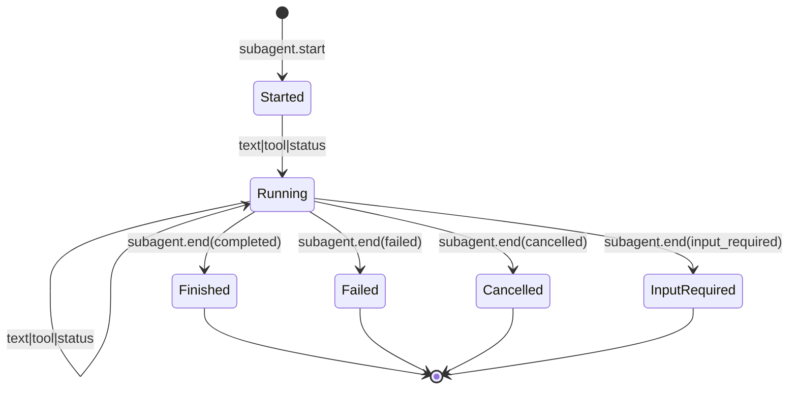

# Workstream: Unified Subagent Streaming

> 状态：已实施。Core、bridge、Claude/Codex/Cursor adapter、CopilotKit 前端与示例均已落地；仍需真实 provider 环境持续验证 Codex follow-child 与 team web E2E。

## 0. 先把结论写死

1. **不新增第二条执行入口，也不新增第四条公共 channel。** Subagent 是 `StreamEvents()` 上的第四条可选维度（对齐 §10 Streaming / §11 HITL），父 `Run/Start` 语义不变。
2. **core 只认识协议无关的作用域维度**：在既有 `StreamPayload` 上加零值安全字段 `Subagent *SubagentRef`，并新增最少边界 Kind：`subagent.start` / `subagent.status` / `subagent.end`。作用域内文本、推理、工具调用**复用**现有 `text.*` / `reasoning.*` / `tool_call.*`。
3. **各 adapter 继续只解析自己的正式协议**：Claude `Agent` + `parent_tool_use_id` + `task_*`；Codex `collab_tool_call` / `collabAgentToolCall`（双轨，exec 路径能力降级见 §8.3）；Cursor `taskToolCall`（见 §8.4）。Shared helper 不偷解析。
4. **A2A 不进 core**：保留 `pkg/hosttools/a2adelegation.DelegationEvent` + `EventBus` 作为 host-tool DTO / 内部传输；在 `pkg/bridges/subagentstream` 边界映射为相同的 `StreamPayload.Subagent` 维度。
5. **父级委派调用继续输出标准 `TOOL_CALL_*`**（Claude `Agent`、Codex collab tool、MCP `delegate_to_agent`），保证旧 CopilotKit 通用工具卡片兼容。
6. **AG-UI 默认渲染走 `ACTIVITY_SNAPSHOT` / `ACTIVITY_DELTA`**（`activityType="subagent"`，稳定 `messageId=SubagentID`）；`CUSTOM subagent.*` 降为 legacy 模式。
7. **SessionStore 接口与父 session 语义不变**：本地可恢复 child 用独立 `(Namespace, Key)`；A2A child 用独立 `ContextID/TaskID` + 宿主侧 `SubagentSessionRef` 索引；失败 / 取消 / 无有效 checkpoint 不得污染父 session。UI 历史继续属于 session recorder，不塞进 SessionStore。
8. **子文本 token delta 不是普适能力**：Claude 实测只有生命周期 + 内部 tool_use/tool_result + task_progress；Cursor 可能更少。合同必须允许诚实降级。

## 1. 目标

让宿主与 CopilotKit 前端用**同一套合同**观察：

- Claude Code / Codex / Cursor 的 **provider 原生 subagent**
- Team 模式下 MCP `delegate_to_agent` → A2A 的 **host-owned delegation**

并在 SessionStore、AG-UI Activity、前端 `SubagentCard` 三层对齐。

## 2. 为什么现在做

当前存在两套彼此割裂的模型：

| 来源 | 现状 |
|---|---|
| Claude 原生 `Agent` / `Task` | 扁平化为普通 `StreamToolCall*`；`parent_tool_use_id` / `task_*` / 子 tool 活动被忽略或只进 Transcript |
| Codex multi_agent / `collab_tool_call` | schema 有 camelCase `collabAgentToolCall`；`exec --json` 实测为 snake_case，且常只露出 `wait`；spawn/child 细节在 rollout，Go 未建模 |
| Cursor `taskToolCall` | CLI 实测存在原生 Task/subagent；父流仅 start/completed + 终局 `conversationSteps` 文本，无子工具/token 流；当前 parser 未识别嵌套 `taskToolCall` |
| A2A delegation | 独立 `DelegationEvent` + EventBus；`subagentstream` 叠成 AG-UI `CUSTOM subagent.*` |

结果：

- CopilotKit 只能显示父级工具卡片（`INPROGRESS`），看不到实时 subagent 卡片。
- `Kind==""` 编码与 Codex opaque notification 撞车。
- Session / 远端 task / UI history 命名混乱，易污染父 session。

本机 Claude Code `2.1.159` 实测（`stream-json` + `--include-partial-messages`）已证明：

- 父流有完整 `tool_use{name:"Agent"}` + `input_json_delta`
- 子流有 `parent_tool_use_id`、`subagent_type`、`task_started/progress/notification`、内部 `assistant tool_use` / `user tool_result`
- **没有**子 Agent 自身的 `stream_event` token delta

因此缺口在 adapter / bridge 映射，不在 Claude CLI 数据。

## 3. 非目标

- 不新增 `RunHandle.SubagentEvents()` 第四条公共 channel
- 不把 A2A / MCP / registry / 自动 routing 塞进 core SDK
- 不要求 Codex / Cursor 伪装成 Claude `content_block` wire protocol
- 不保证所有 provider 都有子文本 token 流
- 不把 UI history / HITL pending / delegation 状态写入 `SessionStore`
- 不改变 `Output` / `RawStreams` / `Transcript` / `Summary` / `Result` 分层合同
- 不引入 broker / planner / 自动 agent selection

## 4. 定位与边界

```text
Provider native subagent / MCP delegate_to_agent
        │
        ▼
Adapter or a2adelegation (各自正式协议解析)
        │
        ▼
StreamPayload{ Subagent: *SubagentRef, Kind: text.*|tool_call.*|subagent.* }
        │
        ├─ StreamEvents()  ──► 宿主 / sessionrecorder
        │
        └─ pkg/bridges/agui Translator
                ├─ 父委派工具  → TOOL_CALL_*
                └─ 子作用域    → ACTIVITY_SNAPSHOT / ACTIVITY_DELTA
                        │
                        ▼
                CopilotKit renderActivityMessages → SubagentCard
```

硬约束（对齐 [`AGENTS.md`](../AGENTS.md)）：

- 单一执行入口：`Runner.Run/Start` + `adapter.Run(ctx, req, sink)`
- 依赖局部化：AG-UI 只在 `pkg/bridges/*`；A2A 只在 `pkg/clients/a2a` + `pkg/hosttools/a2adelegation`
- Shared helper 不解析 provider / subagent 协议
- Adapter 发射的所有 Kind 上 `Role` 必须保持零值

## 5. ID 与父子关联

| 层 | ID | 说明 |
|---|---|---|
| 业务 / AG-UI | `ThreadID` | 父对话线程 |
| SDK 入参 | `SessionKey=(Namespace, Key)` | 父 session 业务键 |
| SDK 句柄 | `SessionID` | 父 driver 句柄 |
| 执行实例 | `RunID` | 父 run；subagent 事件挂在其下 |
| 父工具调用 | `ParentToolCallID` | 派生该 subagent 的父 `tool_call` id |
| 子作用域 | `SubagentID` | run 内稳定；native 用 provider task/agent id；A2A 用 `DelegationID` |
| 远端（A2A） | `RemoteTaskID` / `RemoteContextID` | 只进 `Raw` / 宿主索引，不进父 checkpoint |
| 本地 child session（可选） | 独立 `(Namespace, Key)` / `SessionID` | 仅本地可 resume 的 child Runner |

父子关联三元组（UI 分组锚点）：

```text
(RunID, ParentToolCallID?, SubagentID)
```

`ParentToolCallID` 可缺省（宿主无法供应时）；缺省时 UI 退化为 `(RunID, SubagentID)`。

## 6. 统一数据模型

### 6.1 Core 增量（additive，零值向后兼容）

```go
// run_types.go

const (
    StreamSubagentStart  StreamKind = "subagent.start"
    StreamSubagentStatus StreamKind = "subagent.status"
    StreamSubagentEnd    StreamKind = "subagent.end"
)

// SubagentRef associates a StreamPayload with a child agent scope.
// nil means the parent/root scope — every historical payload stays valid.
type SubagentRef struct {
    ID         string // required; stable within the parent RunID
    ParentID   string // optional; empty = directly under root run
    Name       string // display name / agent key
    Kind       string // "native" | "delegated"
    Protocol   string // "" for native; "a2a" for host delegation
    ToolCallID string // parent tool_call that spawned this scope, if known
}

type StreamPayload struct {
    // ... existing fields unchanged ...
    Subagent *SubagentRef // NEW; adapters MUST leave nil on parent-scope events
}
```

### 6.2 StreamCapability 扩展

```go
type StreamCapability struct {
    // ... existing Native/TokenLevel/Reasoning/ToolCallArgs/HITL ...
    Subagents           bool // can expose child scopes
    SubagentNesting     bool // multi-level ParentID
    SubagentToolLinkage bool // can fill SubagentRef.ToolCallID
    SubagentTextDelta   bool // child text token deltas available
}
```

### 6.3 作用域内事件复用

| 语义 | Kind | `Subagent` |
|---|---|---|
| 开作用域 | `subagent.start` | 非 nil，必填 ID/Name/Kind |
| 进度状态 | `subagent.status` | 非 nil；`Name`/`Result`/`Delta` 承载状态摘要 |
| 子文本 | `text.start/content/end` | 非 nil |
| 子推理 | `reasoning.*` | 非 nil |
| 子工具 | `tool_call.*` | 非 nil |
| 关作用域 | `subagent.end` | 非 nil；`Result` 含终态 status / summary / error |

**不**为 tool 活动再发明平行 Kind；Claude 内部 `Read` / Codex shell / A2A tool-call artifact 都落在 `tool_call.*` 上并带 `Subagent`。

### 6.4 A2A host-tool DTO（保留，不上浮）

`a2adelegation.DelegationEvent` 继续作为 A2A 内部事件。映射规则：

| DelegationEventKind | StreamPayload |
|---|---|
| `subagent.started` | `subagent.start` + `Subagent{Kind:"delegated", Protocol:"a2a", ID:DelegationID, Name:AgentKey, ToolCallID:ParentToolCallID}` |
| `subagent.status` | `subagent.status` |
| `subagent.text.*` | `text.*`（带 Subagent） |
| `subagent.reasoning.delta` | `reasoning.content`（带 Subagent） |
| `subagent.tool_call` | `tool_call.start/args/result`（按 `ToolCall.Phase`） |
| `subagent.artifact` | `subagent.status` + `Raw["artifact"]`，或后续专属 Raw |
| `subagent.finished/failed/cancelled/input_required` | `subagent.end` + Result/Error |

A2A 专属字段（`RemoteTaskID` 等）进入 `StreamPayload.Raw`，不污染 core 类型。

## 7. 生命周期状态机与不变量



硬不变量：

1. `subagent.start{ID}` 必须先于任何带相同 `Subagent.ID` 的 payload。
2. 作用域内所有 text/tool/reasoning/status 必须带同一 `Subagent.ID`。
3. 每个 `ID` 恰好一次 `subagent.end`；之后禁止再发同 ID 事件。
4. `Seq` 在包含 subagent kind 的全部 payload 上单调（dualSink 计数器）。
5. **父 run 终止时若仍有未关闭作用域 → bridge/SDK 合成 `subagent.end(failed|cancelled)`**（上升现有 `subagentstream` FlushSynthetic 为合同）。
6. **子作用域不是独立 SDK session**；remote / child ids 不得写入父 `DriverCheckpoint`。
7. Adapter 在所有 Kind 上保持 `Role` 零值。
8. Subagent 内容不得写入父 `RunResult.Output`；父模型只通过父 tool_result / MCP `DelegationResult` 看到终局摘要。

## 8. Provider / A2A 逐源映射

### 8.1 能力矩阵（本机实测，2026-07-21）

| 来源 | Subagents | ToolLinkage | Nesting | TextDelta | 作用域内粒度 |
|---|---|---|---|---|---|
| Claude native `Agent` | yes | yes（父 `tool_use.id`） | limited | **no**（实测） | task_* + 完整子 tool_use/result + 终局 content |
| Codex multi_agent（`codex-cli 0.144.6`） | yes | **partial on exec**；**yes on app-server follow-child** | yes（thread 树） | **exec: no**；**app-server follow-child: 可复用父同款 delta** | exec 父流几乎只有 `wait`；实时流应 `thread/resume(child)` 复用既有 translator（§8.3.5） |
| Cursor Agent CLI（`2026.01.28-fd13201`） | yes（`taskToolCall`） | yes（`call_id`） | 文档称有限嵌套；父 jsonl 未见 | **headless jsonl: no**；**内部 taskToolCallDelta: yes** | 父 stream-json 仅 start/completed；TUI 吃内部 delta，待投影或 ACP 复用（§8.4.5） |
| A2A delegation | yes（host-tool） | yes（ParentToolCallID） | no | when stream=true | DelegationEvent 全套 |

> 探测工件：`/tmp/subagent-probe/codex-spawn.jsonl`、对应 `~/.codex/sessions/.../rollout-*.jsonl`；`/tmp/subagent-probe/cursor-subagent.jsonl`。

### 8.2 Claude Code

父流：

```text
stream_event content_block_start tool_use name=Agent
  → StreamToolCallStart{ToolCallID, Name:"Agent", Args?}
input_json_delta
  → StreamToolCallArgs
content_block_stop
  → StreamToolCallEnd
```

开子作用域：

```text
system task_started / 首个 parent_tool_use_id 事件
  → StreamSubagentStart{
       Subagent: {
         ID: task_id|agentId,
         Name: subagent_type,
         Kind: "native",
         ToolCallID: parent_tool_use_id,
       }
     }
```

子活动：

```text
assistant{parent_tool_use_id, tool_use}
  → StreamToolCallStart/End（带 Subagent）
user{parent_tool_use_id, tool_result}
  → StreamToolCallResult（带 Subagent）
system task_progress
  → StreamSubagentStatus{Delta|Result: description/last_tool_name/usage}
```

关闭：

```text
system task_notification status=completed
+ 父 user tool_result(Agent)
  → StreamSubagentEnd{Result: summary/content/usage}
  → 父 StreamToolCallResult（Agent 终局）
```

注意：子文本 token delta **不宣称存在**；终局文本来自 Agent `tool_result.content`。

### 8.3 Codex（实测）

**环境：** `codex-cli 0.144.6`；`features.multi_agent=stable/true`，`multi_agent_v2=under development/true`；探测走 `codex exec --json --enable multi_agent --enable multi_agent_v2`。

#### 8.3.1 公开父流（`exec --json`）实际看到什么

父 stdout 事件类型是 snake_case item 流，不是 app-server camelCase：

```text
item.started|completed.item.type = "collab_tool_call"
item.tool ∈ {"wait", ...}          # 本次两次探测只观测到 wait
item.sender_thread_id              # 父 thread
item.receiver_thread_ids           # 本次均为 []
item.agents_states                 # 本次均为 {}
item.status ∈ {in_progress, completed}
```

**关键缺口（必须写进能力降级）：**

1. 内部确实调用了 `collaboration.spawn_agent`（见 rollout `function_call`），并产生独立 child thread（`agent_thread_id`）与 `event_msg.sub_agent_activity{kind:started}`。
2. 但这些 **没有** 投影成父 `exec --json` 的 `collab_tool_call{tool:spawnAgent}`；父流只露出随后的 `wait`。
3. Child 内部 `exec_command` / assistant 终局文本只存在于 **child rollout**（`thread_source=subagent`，`source.subagent.thread_spawn.parent_thread_id=...`），**不**出现在父 `exec --json`。
4. 因此：仅靠今日 `exec --json` **无法**做 Claude 级「作用域内 tool 流 + status」；最多合成粗粒度 `subagent.start/end`（若能从别处拿到 child id），或只把可见的 `collab_tool_call` 映射为父 `TOOL_CALL_*`。

#### 8.3.2 内部 rollout（非公共 SDK 合同）补充事实

| 内部事件 | 含义 |
|---|---|
| `function_call name=spawn_agent namespace=collaboration` | 真正开子 agent；args 含 `task_name` / 加密 `message` |
| `event_msg.sub_agent_activity{kind:started, agent_thread_id, agent_path}` | 子作用域 ID / 路径（如 `/root/readme_worker`） |
| child rollout `function_call exec_command` | 子工具活动（父流不可见） |
| `function_call name=wait_agent` | 对应父流 `collab_tool_call.tool=wait` |

#### 8.3.3 与 app-server schema 的双轨

| 层 | 形状 |
|---|---|
| app-server JSON Schema | camelCase `collabAgentToolCall`；`tool∈{spawnAgent,sendInput,resumeAgent,wait,closeAgent}`；字段 `receiverThreadIds` / `agentsStates` |
| `exec --json`（实测） | snake_case `collab_tool_call`；本次仅见 `wait`；`receiver_thread_ids`/`agents_states` 空 |

Go `codex/appserver/union.go` 今日 **未建模** `collabAgentToolCall`，未知 item 走 Raw / `Kind==""`。落地时：

- 必须同时识别 **camelCase + snake_case** 两种 wire。
- `item/started|completed` → 父 `StreamToolCallStart/End`（Name=`spawnAgent|wait|...`）。
- **仅当** notification / item 能提供稳定 child id（`receiverThreadIds[0]` 或等价）时才发 `subagent.start/end`。
- **不要**宣称父流有子 TextDelta / 子 tool_call，除非 app-server 路径实测证明有（exec 路径已证伪）。
- 未知 collab 变体：**禁止**与 opaque notification 共用 `Kind==""`；至少 `subagent.status` + Raw。

#### 8.3.4 推荐 Descriptor（exec 路径诚实值）

```text
Subagents=true（有 collab 边界）
SubagentToolLinkage=partial（wait 有 item.id；spawn 常缺失）
SubagentNesting=false（对父 StreamPayload 而言）
SubagentTextDelta=false
```

若未来只在 app-server 路径补齐 spawn/child 投影，再上调 capability，并加 live golden。

#### 8.3.5 实时流复用（推荐路径：app-server follow-child）

**能复用，而且应复用既有 Codex streaming translator，而不是另写一套子协议。**

依据（Codex app-server README / multi-agent v2）：

1. Child 是一等 `thread`：`thread/list?parentThreadId=` / `ancestorThreadId=` 可枚举；`thread/read` 返回 `parentThreadId` / `agentNickname`。
2. `thread/start` / `thread/resume` / `thread/fork` **auto-subscribe** 该 thread 的 `turn/*` + `item/*`（含 `item/agentMessage/delta`、command/file 等）——与父线程同一套通知。
3. 父侧用 `sub_agent_activity` / `collabAgentToolCall` / rollout 里的 `agent_thread_id` 拿到 child id 后，在**同一 app-server 连接**上 `thread/resume(childId)`（或等价 subscribe），即可拿到子实时流。
4. Upstream 正把 v2 生命周期收敛到 completion-only `subAgentActivity` item（替代部分 legacy collab begin/end）；本仓库 vendored schema 尚未收入该 variant 时，adapter 仍应按 Raw 前向兼容。

**Adapter 复用合同（streaming / app-server 路径）：**

```text
父 notification: spawn / subAgentActivity{agent_thread_id}
  → StreamToolCallStart(Name=spawnAgent|…) + StreamSubagentStart{ID=childThreadId}
  → appserver.ResumeOrSubscribe(childThreadId)   // 同连接多路复用
  → 既有 Translator 处理 child 的 item/* delta
       但 EmitStream 时强制打上 Subagent{ID:childThreadId, ToolCallID:parentCallId}
  → child turn/completed 或 wait/close
  → StreamSubagentEnd + 父 StreamToolCallResult
```

硬约束：

- **不要**把 child 事件写进父 `SessionID` checkpoint；child 用独立 thread id，仅通过 `SubagentRef` 关联。
- `exec --json` 路径**没有**这套订阅面 → 保持 §8.3.4 降级；streaming 默认已走 app-server，应优先实现 follow-child。
- 子 TextDelta / 子 tool 流在 follow-child 成功后可上调为 `true`（以 app-server live golden 为准），与 exec 路径 Descriptor 可以分通路声明。

### 8.4 Cursor（实测）

**环境：** Cursor Agent CLI `2026.01.28-fd13201`（`agent`）；`-p --output-format stream-json --stream-partial-output`。

#### 8.4.1 原生 subagent 工具存在：`taskToolCall`

父流观测到完整一对：

```text
{"type":"tool_call","subtype":"started","call_id":"...",
 "tool_call":{"taskToolCall":{"args":{
   "description":"...",
   "prompt":"...",
   "subagentType":{"unspecified":{}},
   "model":"composer-2.5-fast",
   "agentId":"<request-or-handle-id>",
   "mode":"TASK_MODE_UNSPECIFIED",
   "environment":"SUBAGENT_EXECUTION_ENVIRONMENT_UNSPECIFIED"
 }}}}

{"type":"tool_call","subtype":"completed","call_id":"...",
 "tool_call":{"taskToolCall":{
   "args":{...same...},
   "result":{"success":{
     "conversationSteps":[{"assistantMessage":{"text":"- ...\n- ...\n- ..."}}],
     "agentId":"<execution-id>",   // 可与 args.agentId 不同
     "isBackground":false,
     "durationMs":"5857"
   }}
 }}}
```

#### 8.4.2 映射合同

| SDK 字段 | Cursor 来源 |
|---|---|
| 父 `StreamToolCall*` | `type=tool_call` + Name=`Task`（或 `taskToolCall`）+ `ToolCallID=call_id` |
| `Subagent.ID` | 优先 `result.success.agentId`，缺省回退 `args.agentId` |
| `Subagent.Name` | `args.description` |
| `Subagent.ToolCallID` | 父 `call_id` |
| `Subagent.Kind` | `"native"` |
| `subagent.start` | 与 `tool_call/started(taskToolCall)` 同时 |
| `subagent.end` | `tool_call/completed`；`Result.text` ← `conversationSteps[].assistantMessage.text` 拼接 |

#### 8.4.3 诚实降级（已证伪项）

- **无**子作用域 token TextDelta（started→completed 之间没有子 `assistant`/`tool_call` 事件）。
- **无**子内部工具调用流（本次子任务读文件的细节未出现在父 stream-json）。
- **无** Nesting 证据（未见 Task 内再开 Task）。
- 父侧仍有 `thinking` delta（与 subagent 并行），但属于父 Role，不是子作用域。
- 今日 `cursor/parser.go` 对 `tool_call` 取顶层 `name`/`input`，**读不到**嵌套 `taskToolCall`；streaming parser 落地时必须按 discriminated tool 对象解析。

#### 8.4.4 推荐 Descriptor

```text
Subagents=true
SubagentToolLinkage=true
SubagentNesting=false
SubagentTextDelta=false   # 对今日 headless stream-json 诚实；见 §8.4.5
```

#### 8.4.5 实时流复用（内部有、headless 未投影）

**能力存在，但不能假装今日 `-p --output-format stream-json` 已经给出。**

内部证据（Cursor Agent `2026.01.28` JS / protobuf）：

- 交互层消费 `tool-call-delta`，其中 `delta.case = taskToolCallDelta`。
- `TaskToolCallDelta` 携带 `interaction_update`，驱动 `subagentState`：`completedSteps` / `pendingTurn` / `thinkingContent` / `liveTokens`。
- `ConversationStep` oneof 含 `assistant_message` / `tool_call` / `thinking_message` —— 即子作用域内文本、工具、thinking 的完整步进模型。
- CLI changelog / Subagent UI：「live status / streamed activity / token counts」走的是这套内部状态机（TUI / editor），不是父 jsonl 里多出来的行。

Headless 复测（含加长 Task，`cursor-long.jsonl` 217 行）：

- `tool_call/started(taskToolCall)` → … → `tool_call/completed(taskToolCall)` 之间 **没有** `tool_call` delta / nested assistant / nested tool 事件。
- 中间只有父级 `thinking` / `assistant` 分片。

**可复用策略（按可行性排序）：**

| 策略 | 做法 | 评价 |
|---|---|---|
| A. 投影内部 delta | 若 Cursor 后续把 `taskToolCallDelta` / `tool_call`+`subtype=delta` 打进 stream-json，adapter 直接映射为带 `Subagent` 的 `text.*`/`tool_call.*`/`reasoning.*` | **首选**；与统一合同零阻抗 |
| B. ACP / 富通道 | 若 Agent Client Protocol 或 SDK 暴露与 TUI 相同的 interaction updates，在 cursor adapter 的 ACP/SDK 通路复用同一 Translator | 局部化在 `cursor/`；core 仍只见 `StreamPayload` |
| C. 二次 `agent --resume <agentId>` | 用 `args.agentId` / `result.agentId` 另开 run 拉历史 | **不是**父 run 内实时流；只适合事后回放，不满足 Activity 直播 |
| D. 维持降级 | 仅 start/end + 终局 `conversationSteps` 文本 | 今日默认；UI 显示「子任务进行中」直到 completed |

结论：Cursor **可以**复用「与普通 tool/text 相同的 StreamPayload 形状」来表达子实时流，前提是拿到内部 `taskToolCallDelta` 的投影；在投影未进 headless 之前，Descriptor 必须保持 `SubagentTextDelta=false`，不得伪造。

### 8.5 MCP → A2A delegation

保持现有：

- MCP tool 只返回终局 `DelegationResult`（进父模型上下文）
- 实时进度进 EventBus，经 `subagentstream` 映射为带 `Subagent` 的 `StreamPayload`
- 父 `delegate_to_agent` 仍是标准 tool_call 卡片

## 9. SessionStore 规则

### 9.1 分层

```text
父 Run (RunID, SessionKey_parent, SessionID_parent)
  └─ SubagentID
        ├─ native: 内生于 provider session；通常 ephemeral / unresumable at SDK layer
        ├─ local child Runner（少见）: SessionKey_child = 独立 (Namespace, Key)
        └─ A2A: ContextID / TaskID + 宿主 SubagentSessionRef（非 SessionStore）
```

### 9.2 宿主侧索引（core 之上，建议类型）

```go
// hosttools / example 层，不进 SessionStore
type SubagentSessionRef struct {
    ParentRunID      string
    ParentToolCallID string
    SubagentID       string
    AgentKey         string
    Kind             string // native|delegated
    Protocol         string // ""|a2a
    SessionRef       *agentadaptor.SessionRef // 仅本地 child Runner
    RemoteTaskID     string
    RemoteContextID  string
    Resumable        bool
}
```

### 9.3 硬规则

| 规则 | 说明 |
|---|---|
| 独立 Key | 本地 child 禁止复用父 `(Namespace, Key)`，否则失败会 rebind 父 active mapping |
| 并行 | 同 Key 有 lease；并行 subagent 必须不同 Key |
| Checkpoint | 仅 `checkpoint.Valid && State != nil` 才 Finalize；失败默认不 persist |
| HITL 无 checkpoint | 已有 skip 路径；child 同理不得污染父 |
| Cancel | 父 cancel → 取消进行中的 child / A2A CancelTask；不 Finalize 父 session |
| Fork | SDK fork 仍是新 SessionID + 可能 resume 同一 provider thread；child 不自动 fork |
| A2A 续聊 | 显式传入 `ContextID/TaskID`；当前 team role hub 默认 Stateless，续聊需宿主打开 SessionMapper |
| UI history | `sessionrecorder` / Activity message；不是 SessionStore |

### 9.4 推荐 Key 方案

```text
本地 child:
  Namespace = "subagent"
  Key       = "<parentRunID>:<agentKey>:<subagentID>"

A2A:
  ContextID = "<parentRunID>:<agentKey>"   // 同 agent 多轮可复用
  TaskID    = 上次 DelegationResult.RemoteTaskID（仅显式续聊）
```

## 10. AG-UI 映射

### 10.1 SubagentMode（复刻 DecisionMode）

```go
type SubagentMode int

const (
    SubagentAsActivity SubagentMode = iota // default
    SubagentAsToolCall                     // CopilotKit SubagentCard via TOOL_CALL_*
    SubagentAsCustom                       // legacy CUSTOM subagent.*
)
```

### 10.2 默认：ActivitySnapshot / Delta

稳定键：

- `messageId` = `SubagentID`（跨 snapshot/delta 不变）
- `activityType` = `"subagent"`

首帧 / 重连全量：

```json
{
  "type": "ACTIVITY_SNAPSHOT",
  "messageId": "a5a2c1df9e14b4a67",
  "activityType": "subagent",
  "replace": true,
  "content": {
    "subagentId": "a5a2c1df9e14b4a67",
    "runId": "run-...",
    "parentToolCallId": "call_RbI4...",
    "agentKey": "stream-probe",
    "agentName": "stream-probe",
    "kind": "native",
    "protocol": "",
    "status": "running",
    "description": "Probe README summary",
    "text": "",
    "toolCalls": [],
    "usage": {},
    "error": null,
    "startedAt": "2026-07-21T07:49:17Z",
    "updatedAt": "2026-07-21T07:49:20Z"
  }
}
```

增量（RFC 6902 JSON Patch）：

```json
{
  "type": "ACTIVITY_DELTA",
  "messageId": "a5a2c1df9e14b4a67",
  "activityType": "subagent",
  "patch": [
    {"op": "replace", "path": "/description", "value": "Reading README.md"},
    {"op": "add", "path": "/toolCalls/-", "value": {
      "id": "call_FlPA...",
      "name": "Read",
      "status": "completed",
      "args": {"file_path": ".../README.md", "limit": 20},
      "result": {"text": "..."}
    }},
    {"op": "replace", "path": "/status", "value": "completed"},
    {"op": "replace", "path": "/text", "value": "- bullet 1\n- bullet 2\n- bullet 3"}
  ]
}
```

Go SDK 构造函数（已存在，当前未使用）：

```go
aguievents.NewActivitySnapshotEvent(messageID, "subagent", content)
aguievents.NewActivityDeltaEvent(messageID, "subagent", patch)
```

### 10.3 父级工具调用（始终保留）

无论 Mode：

```text
TOOL_CALL_START  name=Agent|spawnAgent|delegate_to_agent|...
TOOL_CALL_ARGS
TOOL_CALL_END
TOOL_CALL_RESULT  // 终局摘要；与 Activity 终态对齐但不互相替代
```

### 10.4 Legacy CUSTOM

`SubagentAsCustom` 保留今日 `subagentstream.AGUICustomEvent` 形状，供旧宿主过渡。新默认路径不得依赖 CUSTOM 渲染。

### 10.5 修复 `Kind==""` 撞车

统一后禁止再用 `Kind:""` 编码 subagent；Codex opaque notification 继续 CUSTOM，但 name 空间与 `subagent.*` / Activity 分离。

## 11. 前端对接（CopilotKit 1.56.2）

### 11.1 已核实 API

`@copilotkit/react-core`（showcase `web-copilotkit-hitl`）：

```ts
interface ReactActivityMessageRenderer<TActivityContent> {
  activityType: string;          // use "subagent" or "*"
  agentId?: string;
  content: StandardSchemaV1<any, TActivityContent>;
  render: React.ComponentType<{
    activityType: string;
    content: TActivityContent;
    message: ActivityMessage;
    agent: AbstractAgent | undefined;
  }>;
}

// CopilotKit / CopilotKitProvider props:
renderActivityMessages?: ReactActivityMessageRenderer<any>[];
```

另有 hook：`useRenderActivityMessage`。

### 11.2 注册示例

```tsx
import { CopilotKit } from "@copilotkit/react-core";
import { z } from "zod";
import { SubagentCard } from "./components/subagent-card";

const SubagentContentSchema = z.object({
  subagentId: z.string(),
  runId: z.string(),
  parentToolCallId: z.string().optional(),
  agentKey: z.string(),
  agentName: z.string().optional(),
  kind: z.enum(["native", "delegated"]),
  protocol: z.string().optional(),
  status: z.enum([
    "started", "running", "completed", "failed", "cancelled", "input_required",
  ]),
  description: z.string().optional(),
  text: z.string().optional(),
  toolCalls: z.array(z.object({
    id: z.string(),
    name: z.string(),
    status: z.string(),
    args: z.record(z.any()).optional(),
    result: z.record(z.any()).optional(),
  })).default([]),
  usage: z.record(z.any()).optional(),
  error: z.record(z.any()).nullable().optional(),
  startedAt: z.string().optional(),
  updatedAt: z.string().optional(),
});

<CopilotKit
  runtimeUrl="/api/copilotkit"
  agent="codex"
  renderActivityMessages={[
    {
      activityType: "subagent",
      content: SubagentContentSchema,
      render: ({ content, message }) => (
        <SubagentCard content={content} messageId={message.id} />
      ),
    },
  ]}
>
  {children}
</CopilotKit>
```

### 11.3 SubagentCard 行为

- 标题：`agentName|agentKey` + status badge
- 正文：`description` + 累计 `text`
- 列表：内部 `toolCalls`（name/args/result）
- 页脚：usage / duration / error
- 与父级 `TOOL_CALL` 卡片并存：父卡片表示委派边界；Activity 卡片表示子执行流

### 11.4 刷新 / 重连 / 终态

| 场景 | 行为 |
|---|---|
| 中途连上 | bridge 对每个 active SubagentID 先发 `ACTIVITY_SNAPSHOT(replace=true)`，再发后续 delta |
| 页面刷新 | 若有 sessionrecorder：重放已聚合 Activity 或由宿主从 history 重建 snapshot；team 最小后端若无 recorder，则仅 live |
| 父 RUN_FINISHED | 先 FlushSynthetic 未关闭 subagent → 最终 snapshot/delta → 再 RUN_FINISHED |
| 失败 / 取消 | `status=failed|cancelled` + `error`；父 tool_result 同步失败摘要 |

父级 `useCopilotAction({name:"*"})` **继续保留**，用于 Agent / delegate_to_agent / 普通工具；Activity 渲染器只负责 `activityType="subagent"`。

## 12. 兼容与迁移

### 12.1 零值兼容

- 未声明 `Subagents` / 未填 `Subagent` 的 payload：线上形状与今天完全一致。
- 旧宿主忽略未知 StreamKind / Activity 事件应降级，不应崩溃。

### 12.2 模式过渡

| 阶段 | 默认线上 | Legacy |
|---|---|---|
| Phase 1 | Activity + 仍可选 emit CUSTOM | `SubagentAsCustom` |
| Phase 2+ | 仅 Activity（+ 父 TOOL_CALL_*） | CUSTOM 需显式打开 |

### 12.3 文档联动

落地后更新：

- [`docs/streaming.md`](./streaming.md) §4 Visual subagent overlay
- [`docs/a2a.md`](./a2a.md) Visual Delegation Host Tools
- [`AGENTS.md`](../AGENTS.md) 新增 §12 Subagent 是第四条可选维度
- team-agent-workflow / web-copilotkit-hitl README

## 13. 分阶段实施清单

### Phase 0 — Core 合同（无行为变化）

- [x] `run_types.go`：`SubagentRef`、`StreamSubagentStart/Status/End`、`StreamPayload.Subagent`
- [x] `api.go`：`StreamCapability` 扩展字段
- [x] 单元测试：零值序列 golden 不变；Seq 单调；单次关闭不变量
- [x] 本 workstream 文档保持为权威来源

### Phase 1 — Bridge 收敛

- [x] `subagentstream`：`DelegationEvent → []StreamPayload{Subagent}`；停止用 `Kind:""` 编码 subagent
- [x] `agui.Translator`：`SubagentMode`；默认 ActivitySnapshot/Delta 聚合器
- [x] `sse.Options`：文档更新；SubagentBus 路径走新映射
- [x] 保留 `SubagentAsCustom` legacy
- [x] 修复 opaque `Kind:""` 与 subagent 撞车
- [x] bridge / sse integration tests

### Phase 2 — Adapter native 发射

- [x] Claude：解析 `parent_tool_use_id` / `task_*` / 子 tool；声明能力（TextDelta=false）
- [x] Codex：同时建模 app-server `collabAgentToolCall`/`subAgentActivity` 与 exec `collab_tool_call`；streaming 路径实现 follow-child；exec 路径按 §8.3.4 降级
- [ ] Codex：真实 app-server follow-child live golden（需本机 provider 环境持续验证）
- [x] Cursor：识别嵌套 `taskToolCall`；映射父 TOOL_CALL + `subagent.start/end`；当前 headless 投影保持 TextDelta=false
- [ ] Cursor：若 CLI/ACP 将 `taskToolCallDelta` 暴露给 headless 客户端，再接入富通道（当前版本不可观测）
- [x] Golden jsonl fixtures（Claude/Codex/Cursor 均有脱敏样本）
- [x] 断言子 remote/task/agent id **不**写入父 checkpoint

### Phase 3 — 前端与示例

- [x] `web-copilotkit-hitl`：注册 `renderActivityMessages` + `SubagentCard`
- [ ] `team-agent-workflow --web-mode`：端到端验证 plan/impl/review Activity 卡片
- [ ] 可选：sessionrecorder 持久化 Activity 快照便于刷新恢复
- [x] 更新 streaming.md / a2a.md / AGENTS.md / showcase README

## 14. 测试矩阵

| 层 | 用例 |
|---|---|
| Core | `Subagent==nil` golden 不变；start→events→end；重复 end 拒绝；父结束后禁止同 ID |
| Claude | Agent tool_use → 父 TOOL_CALL；task_progress → status；子 Read → 带 Subagent 的 tool_call；无假 TextDelta |
| Codex | `collab_tool_call`/`collabAgentToolCall` 双轨；wait/spawn 映射；exec 路径无假子 TextDelta；未知 item 不 silent drop |
| Cursor | `taskToolCall` → 父 TOOL_CALL + subagent.start/end；`agentId`/`call_id` 关联；无假子 TextDelta/Nesting |
| a2adelegation | DelegationEvent 映射字段完整；ToolCall phase；terminal 合成 |
| subagentstream | 与父流合并顺序；FlushSynthetic；replay/dedupe；import_boundary（core 无 A2A 符号） |
| agui | Activity snapshot/delta well-formed；三种 SubagentMode；RUN_FINISHED 后无事件 |
| session | 并行不同 Key；child 失败不 rebind 父；cancel 不 persist；checkpoint 隔离 |
| SSE | SubagentBus + Activity 帧；CORS/重连首帧 snapshot |
| Frontend | renderActivityMessages 渲染；父工具卡片仍在；刷新策略（有/无 recorder） |
| E2E | team-agent-workflow web-mode：plan→impl→review 三张 Activity 卡片实时更新 |

## 15. 依赖选型评估（§2.4）

| 依赖 | 可靠性 | 可持续维护 | 可局部化 | 结论 |
|---|---|---|---|---|
| 已有 `github.com/ag-ui-protocol/ag-ui/sdks/community/go` Activity 事件 | 官方协议构造函数已存在 | 官方 Go SDK | 仅 `pkg/bridges/agui` | **采用**；不新增顶层 require |
| CopilotKit `renderActivityMessages` | showcase 已安装 1.56.2 类型核实 | CopilotKit 主流维护 | 仅 examples 前端 | **采用**；不进 Go module |
| 自研 CUSTOM-only 继续 | 与官方 Activity 语义偏离 | 需自维护聚合 | bridges | **降级为 legacy** |

本次文档阶段**不新增** Go module require。

## 16. 风险

| 风险 | 缓解 |
|---|---|
| Claude 无子文本 delta，用户期望 token 流 | Descriptor.SubagentTextDelta=false；UI 显示工具级进度 + 终局文本 |
| Codex exec 流丢 spawn / 子活动 | 文档已证伪父流完整性；UI 对 Codex 以 wait 边界 + 终局摘要为主；app-server 路径另做 live 验证后再上调能力 |
| Codex collab 未建模导致继续丢失 | Phase 2 必做双轨建模；未知 variant 至少 Raw+status |
| Cursor parser 读不到 `taskToolCall` | Phase 2 按嵌套 discriminated tool 解析；fixture 用本次 stream-json |
| Activity 与父 TOOL_CALL 双卡片重复 | 文档明确分工：父=委派边界，Activity=子执行；UI 可折叠关联 |
| 刷新无 history | sessionrecorder 可选；最小 team web 诚实声明 live-only |
| 把 child 写入父 SessionKey | 测试护栏 + 文档硬规则 |
| `Kind==""` 撞车 | Phase 1 消除 subagent 的空 Kind 编码 |
| 前端 schema 过严导致不渲染 | content schema 字段尽量 optional；未知字段透传 |

## 17. 与现有文档的关系

| 文档 | 关系 |
|---|---|
| [`AGENTS.md`](../AGENTS.md) | 落地后增补 §12 |
| [`streaming.md`](./streaming.md) | Phase 1 后改写 §4 overlay |
| [`a2a.md`](./a2a.md) | Phase 1 后改写 Visual Delegation 输出形状 |
| [`workstream-streaming-chat.md`](./workstream-streaming-chat.md) | 历史；本文件为其 subagent 维度续篇 |
| [`workstream-hitl-v2.md`](./workstream-hitl-v2.md) | DecisionMode 先例；SubagentMode 对齐其模式切换手法 |
| [`workstream-session-recorder.md`](./workstream-session-recorder.md) | UI 历史 / HostSeq；与 SessionStore 分离 |

## 18. 一句话边界

> 统一 Subagent = 在既有 `StreamPayload` 上增加零值安全的子作用域维度；父工具调用仍是 `TOOL_CALL_*`；子执行流默认变成 AG-UI `ACTIVITY_*`；SessionStore 只服务可 resume 的本地句柄且父子分域；A2A 细节留在 hosttools/bridges。不引入第二套 Run，不假装所有 provider 都有子文本 token 流。
