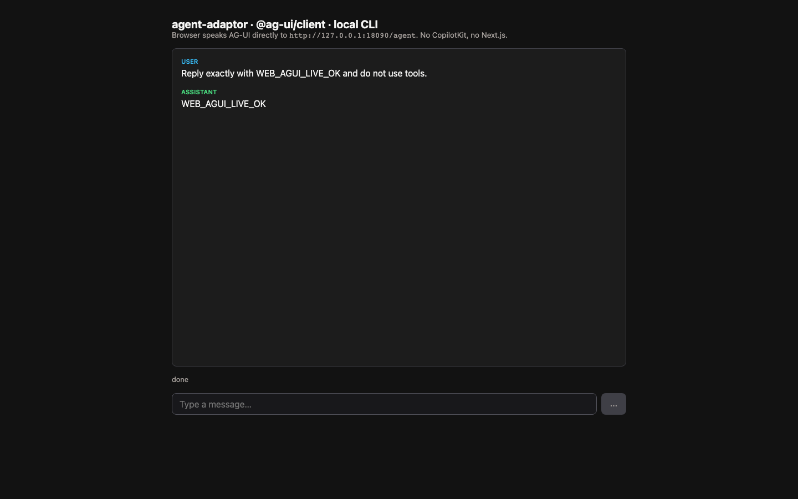

# Direct AG-UI Web Client

This showcase is the shortest browser-to-agent path in the repository: a Vite +
React client uses the official `@ag-ui/client` `HttpAgent` directly against the
Go AG-UI/SSE endpoint. There is no Next.js proxy or CopilotKit runtime.

## Architecture

```text
React + @ag-ui/client HttpAgent
  -> POST /agent (AG-UI RunAgentInput)
  -> host Go server + pkg/bridges/sse
  -> SDK Start / StreamEvents
  -> selected local agent CLI
  <- validated AG-UI SSE lifecycle, text, reasoning, and tool events
```

`ThreadID` is browser-owned. The AG-UI bridge derives the SDK session-key tuple
`("agui", ThreadID)`; the SDK resolves a provider `SessionID` and creates a new
`RunID` for every request.

## Prerequisites

- Go toolchain
- Node.js 20+ and npm
- An installed and authenticated Codex, Claude Code, or Cursor Agent CLI
- Ports 8090 and 5173 available, or matching environment overrides

## Provider Support

Codex and Claude provide content deltas. Cursor can use the same AG-UI lifecycle
but currently does not advertise token-level content streaming. Provider-specific
reasoning and tool events appear only when the selected adapter emits them.

## Setup And Run

From the repository root:

```bash
./examples/showcases/web-agui/start-all.sh codex
```

Select `claude` or `cursor` as the first argument when needed, then open
`http://localhost:5173`.

Manual two-terminal setup:

```bash
# Terminal 1
./examples/showcases/web-agui/start.sh codex

# Terminal 2
cd examples/showcases/web-agui/web
npm ci
npm run dev
```

Backend environment: `AGUI_AGENT`, `AGUI_MODEL`, `ADDR` (default `:8090`),
`CORS_ORIGIN` (default `http://localhost:5173`), and the provider-specific
`*_COMMAND` / `*_MODEL` overrides. Frontend `AGENT_BACKEND_URL` defaults to
`http://localhost:8090/agent`.

## Expected Evidence

The UI shows user and assistant messages, incremental text when supported,
separate reasoning, tool-call cards, run status, and an error state. The backend
health endpoint is `http://localhost:8090/health`.

The screenshot below was captured by Playwright from a real, authenticated
Claude run in an isolated workspace/profile. The assistant returned the
`WEB_AGUI_LIVE_OK` sentinel; it is not a mockup.



## Cleanup

Press `Ctrl-C` in the frontend terminal. `start-all.sh` terminates its backend
child through an exit trap; the backend gracefully removes its temporary
workspace/profile. Remove `web/node_modules` when the local dependency cache is
no longer needed.

## Security Notes

The server has no authentication. Keep it on a trusted development machine,
restrict `CORS_ORIGIN`, and never expose linked local CLI credentials through a
public endpoint. Production hosts must add TLS, authorization, quotas, request
limits, session persistence, and audit logging.

## Known Limitations

- Session state is process-local and not durable.
- The UI does not implement HITL decision resolution or replay.
- The backend uses a temporary workspace and cloned profile for its lifetime.
- Browser reconnection and production deployment are outside the example.

For session replay and HITL cards, use
[`web-copilotkit-hitl`](../web-copilotkit-hitl). See
[streaming](../../../docs/streaming.md) and the
[user-message event contract](../../../docs/workstream-user-message-event.md).
