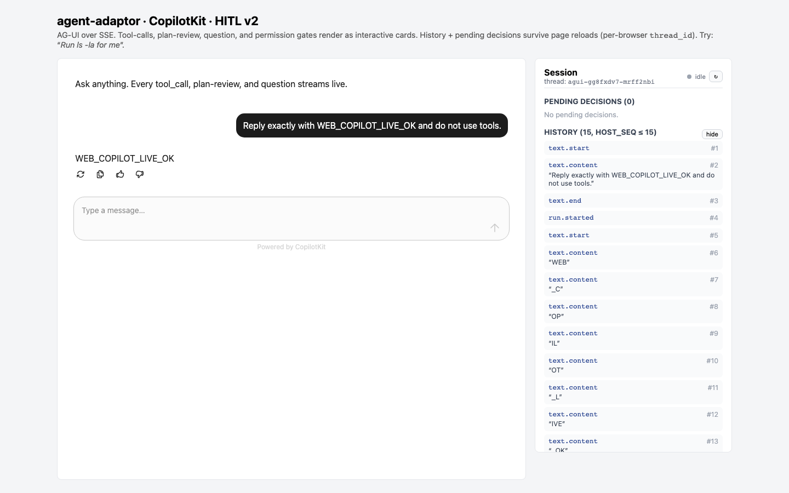

# CopilotKit, Sessions, And HITL

This is the full interactive-product showcase. A Next.js CopilotKit frontend
uses a Go AG-UI backend for content streaming, host-owned transcript replay, and
human decision cards. It also demonstrates how user turns enter the host recorder
without changing adapter-side output semantics.

## Architecture

```text
Browser <CopilotChat>
  -> Next.js /api/copilotkit -> HttpAgent
  -> Go POST /agent -> SDK Start
  <- AG-UI content + lifecycle events

Browser session panel
  -> GET /session/events?thread_id=...&after=...
  -> GET /decision/pending?thread_id=...
  -> POST /decision/resolve
```

The browser owns `ThreadID`. The backend maps it to the SDK session-key tuple
`("agui", ThreadID)`, while each invocation receives a distinct `RunID`. Replay
cursors use monotonic host sequence numbers, not per-run stream sequence numbers.

## Prerequisites

- Go toolchain
- Node.js 20+ and npm
- An installed and authenticated Codex, Claude Code, or Cursor Agent CLI
- Ports 8080 and 3000 available, or matching environment overrides

## Provider Support

| Capability | Codex | Claude | Cursor |
|---|---:|---:|---:|
| AG-UI run lifecycle | yes | yes | yes |
| Content deltas | yes | yes | no |
| PlanReview / Question `Ask` cards | no | yes | no |
| Permission `Ask` cards | no | no | no |

Claude currently demonstrates the richest HITL path. Unsupported `Ask` modes
are rejected before the provider run starts; the UI must not imply otherwise.

## Setup And Run

```bash
./examples/showcases/web-copilotkit-hitl/start-all.sh claude
```

Open `http://localhost:3000`. For lifecycle and replay without provider HITL,
select `codex` or `cursor` as the first argument.

Manual setup:

```bash
# Terminal 1
./examples/showcases/web-copilotkit-hitl/start.sh claude

# Terminal 2
cd examples/showcases/web-copilotkit-hitl/web
npm ci
npm run dev
```

Backend environment: `AGUI_AGENT`, `AGUI_MODEL`, `ADDR` (default `:8080`),
`CORS_ORIGIN`, `THREAD_STORE_DIR`, and provider-specific `*_COMMAND` / `*_MODEL`
overrides. Frontend variables are `AGENT_BACKEND_URL` and
`NEXT_PUBLIC_AGENT_BACKEND_BASE`.

## Expected Evidence

The chat renders user and assistant turns, streaming content when available,
run status, and provider-supported decision cards. Refreshing the page restores
recorded events and pending decisions for the same browser thread. The backend
health endpoint is `http://localhost:8080/health`.

The screenshot below was captured by Playwright from a real, authenticated
Claude run in an isolated workspace/profile. It shows one user turn, the
`WEB_COPILOT_LIVE_OK` assistant response, and the host recorder history after
the run returned to idle; it is not a mockup.



## Cleanup

Press `Ctrl-C`; `start-all.sh` terminates the Go child. If `THREAD_STORE_DIR` was
set, remove or archive its JSONL records according to host retention policy.
The backend removes its temporary workspace/profile during graceful shutdown.
Remove `web/node_modules` when the dependency cache is no longer needed.

## Security Notes

This demo has no user authentication or authorization and defaults to permissive
CORS. Do not expose it publicly. Production hosts must scope thread and decision
access to an authenticated principal, protect decision resolution against replay,
validate retention paths, add TLS and limits, and audit all HITL outcomes.

## Known Limitations

- The default recorder and pending-decision store are process-local.
- JSONL persistence is an example backend, not a multi-process database.
- Permission `Ask` is unsupported by all current built-in adapters.
- Remote A2A sub-agent events require host-provided delegation wiring; this main
  path starts one local parent CLI. The runnable
  [`team-agent-workflow`](../team-agent-workflow) demonstrates the missing
  `delegate_to_agent` MCP + A2A role composition and produces the same
  `subagent.*` event bus that a CopilotKit host can attach through
  `sse.Options.SubagentBus`.

See [run policy](../../../docs/run-policy.md),
[streaming](../../../docs/streaming.md), and the
[session recorder contract](../../../docs/workstream-session-recorder.md).
